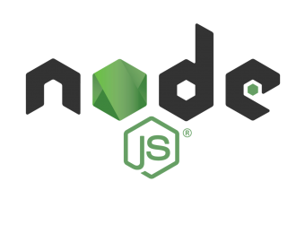

## 深入学习 Node.js 

2017 年一直有个想法，就是好好地学一下 Node.js，后面由于工作需要踏上了 Angular 的踩坑之路，学习期间在 Segmentfault 开了个专栏 [Angular 4.x 修仙之路](https://segmentfault.com/a/1190000008754631)，在写专栏的过程中，亲身体验到了写作的 “艰辛”，同时也感受到了写一篇好文章（通俗易懂、干货十足），需要的投入很多时间和精力，真的特别烧脑。

2018 年已经过了 1/3，为了不想在 2019 年留下遗憾，决定静下心来好好地学一下 Node.js 和相关的框架。多年一直保持做学习笔记的习惯，因此在学 Node.js 的过程，我会用心的整理好学习笔记，有写得不好的地方，欢迎各位小伙伴指出，同时也希望我的笔记对同在 Node.js 探索之路的小伙伴们会有些帮助。

此外，在学习的过程中，也参考了很多大神的文章，感谢他们对知识的无私奉献。

### 目录

#### 理论篇

* [深入学习 Node.js EventEmitter](https://github.com/semlinker/node-deep/blob/master/event/%E6%B7%B1%E5%85%A5%E5%AD%A6%E4%B9%A0%20Node.js%20EventEmitter.md)
* [深入学习 Node.js Buffer](https://github.com/semlinker/node-deep/blob/master/buffer/%E6%B7%B1%E5%85%A5%E5%AD%A6%E4%B9%A0Node.js%20Buffer.md)
* [深入学习 Node.js Module](https://github.com/semlinker/node-deep/blob/master/module/%E6%B7%B1%E5%85%A5%E5%AD%A6%E4%B9%A0%20Node.js%20Module.md)
* [深入学习 Node.js Http 基础篇](https://github.com/semlinker/node-deep/blob/master/http/%E6%B7%B1%E5%85%A5%E5%AD%A6%E4%B9%A0%20Node.js%20Http%20%E5%9F%BA%E7%A1%80%E7%AF%87.md)
* [深入学习 Node.js Http](https://github.com/semlinker/node-deep/blob/master/http/%E6%B7%B1%E5%85%A5%E5%AD%A6%E4%B9%A0%20Node.js%20Http.md)
* [深入学习 Node.js Net](https://github.com/semlinker/node-deep/blob/master/net/%E6%B7%B1%E5%85%A5%E5%AD%A6%E4%B9%A0%20Node.js%20Net.md)

#### 实战篇

* [Node.js Buffer 实战](https://github.com/semlinker/node-deep/blob/master/buffer/Node.js%20Buffer%20%E5%AE%9E%E6%88%98.md)

### 资源

- [深入理解Node.js：核心思想与源码分析](https://yjhjstz.gitbooks.io/deep-into-node/)
- [Davidc.ai - Node.js 源码分析系列](https://davidc.ai/archives/)
- [Xiedacon - Node.js 源码分析系列](http://www.xiedacon.com/archives/)
- [NodeJS源码分析-由浅入深解析架构以及运行原理](https://github.com/fzxa/NodeJS-Nucleus-Plus-Internals)