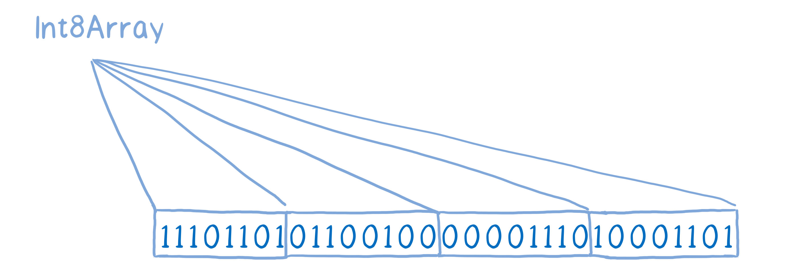
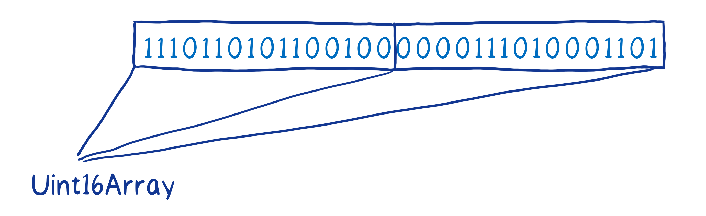
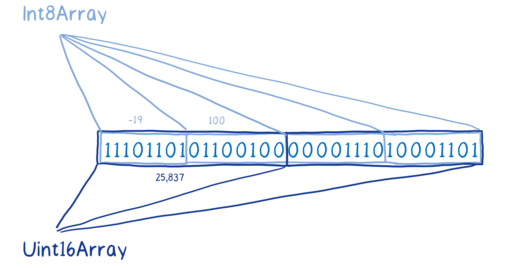

## 深入学习 Node.js Buffer

> 友情提示：本文篇幅较长，可根据实际需要，进行选择性阅读。另外，对源码感兴趣的小伙伴，建议采用阅读和调试相结合的方式，进行源码学习。详细的调试方式，请参考 [Debugging Node.js Apps](https://nodejs.org/en/docs/inspector/) 文章。

<!-- TOC -->

- [深入学习 Node.js Buffer](#深入学习-nodejs-buffer)
    - [预备知识](#预备知识)
        - [ArrayBuffer](#arraybuffer)
            - [语法](#语法)
            - [示例](#示例)
        - [Unit8Array](#unit8array)
            - [语法](#语法-1)
            - [示例](#示例-1)
        - [ArrayBuffer 和 TypedArray](#arraybuffer-和-typedarray)
    - [Node.js Buffer](#nodejs-buffer)
        - [Buffer 基本使用](#buffer-基本使用)
        - [Buffer.from(), Buffer.alloc(), and Buffer.allocUnsafe()](#bufferfrom-bufferalloc-and-bufferallocunsafe)
        - [为什么 Buffer.allocUnsafe() 和 Buffer.allocUnsafeSlow() 不安全](#为什么-bufferallocunsafe-和-bufferallocunsafeslow-不安全)
        - [Buffer 与字符编码](#buffer-与字符编码)
            - [示例](#示例-2)
        - [Buffer 与 TypedArray](#buffer-与-typedarray)
    - [Buffer 内存管理](#buffer-内存管理)
        - [8K 内存池](#8k-内存池)
    - [ascii、unicode 和 utf8](#asciiunicode-和-utf8)
        - [ascii 编码](#ascii-编码)
            - [小结](#小结)
        - [unicode 编码](#unicode-编码)
            - [小结](#小结-1)
        - [utf8 编码](#utf8-编码)
            - [小结](#小结-2)
    - [Buffer 中文处理](#buffer-中文处理)
    - [Buffer slice() vs Array slice()](#buffer-slice-vs-array-slice)
        - [Array slice()](#array-slice)
            - [示例](#示例-3)
        - [Buffer slice()](#buffer-slice)
            - [示例](#示例-4)
    - [字节对齐](#字节对齐)
    - [总结](#总结)
    - [参考资源](#参考资源)

<!-- /TOC -->

### 预备知识

#### ArrayBuffer

ArrayBuffer 对象用来表示**通用的、固定长度的**原始二进制数据缓冲区。**ArrayBuffer 不能直接操作，而是要通过[类型数组对象](https://developer.mozilla.org/zh-CN/docs/Web/JavaScript/Reference/Global_Objects/TypedArray) 或 [`DataView`](https://developer.mozilla.org/zh-CN/docs/Web/JavaScript/Reference/Global_Objects/DataView) 对象来操作**，它们会将缓冲区中的数据表示为特定的格式，并通过这些格式来读写缓冲区的内容。

> ArrayBuffer 简单说是一片内存，但是你不能（也不方便）直接用它。这就好比你在 C 里面，malloc 一片内存出来，你也会把它转换成 unsigned_int32 或者 int16 这些你需要的实际类型的数组/指针来用。
>
> 这就是JS里的 TypedArray 的作用，那些 Uint32Array 也好，Int16Array 也好，都是给 ArrayBuffer 提供了一个 “View”，MDN上的原话叫做 “Multiple views on the same data”，对它们进行下标读写，最终都会反应到它所建立在的 ArrayBuffer 之上。
>
> 来源 https://www.zhihu.com/question/30401979

##### 语法

> new ArrayBuffer(length)

* 参数：length 表示要创建的 ArrayBuffer 的大小，单位为字节。
* 返回值：一个指定大小的 ArrayBuffer 对象，其内容被初始化为 0。
* 异常：如果 length 大于 [`Number.MAX_SAFE_INTEGER`](https://developer.mozilla.org/zh-CN/docs/Web/JavaScript/Reference/Global_Objects/Number/MAX_SAFE_INTEGER)（>= 2 ** 53）或为负数，则抛出一个  [`RangeError`](https://developer.mozilla.org/zh-CN/docs/Web/JavaScript/Reference/Global_Objects/RangeError)  异常。

##### 示例

下面的例子创建了一个 8 字节的缓冲区，并使用一个 [`Int32Array`](https://developer.mozilla.org/zh-CN/docs/Web/JavaScript/Reference/Global_Objects/Int32Array) 来引用它：

```javascript
var buffer = new ArrayBuffer(8);
var view   = new Int32Array(buffer);
```

> 从 ECMAScript 2015 开始，`ArrayBuffer` 对象需要用 [`new`](https://developer.mozilla.org/zh-CN/docs/Web/JavaScript/Reference/Operators/new) 运算符创建。如果调用构造函数时没有使用 `new`，将会抛出 [`TypeError`](https://developer.mozilla.org/zh-CN/docs/Web/JavaScript/Reference/Global_Objects/TypeError)  异常。

#### Unit8Array

Uint8Array 数组类型表示一个 8 位无符号整型数组，创建时内容被初始化为 0。创建完后，可以以**对象的方式或使用数组下标索引的方式**引用数组中的元素。

##### 语法

> Uint8Array(length);//创建初始化为0的，包含length个元素的无符号整型数组
> Uint8Array(typedArray);
> Uint8Array(object);
> Uint8Array(buffer [, byteOffset [, length]]);

##### 示例

```javascript
// 来自长度
var uint8 = new Uint8Array(2);
uint8[0] = 42;
console.log(uint8[0]); // 42
console.log(uint8.length); // 2
console.log(uint8.BYTES_PER_ELEMENT); // 1

// 来自数组
var arr = new Uint8Array([21,31]);
console.log(arr[1]); // 31

// 来自另一个 TypedArray
var x = new Uint8Array([21, 31]);
var y = new Uint8Array(x);
console.log(y[0]); // 21

// 来自 ArrayBuffer
var buffer = new ArrayBuffer(8);
var z = new Uint8Array(buffer, 1, 4);
```

#### ArrayBuffer 和 TypedArray

ArrayBuffer 本身只是一个 0 和 1 存放在一行里面的一个集合，ArrayBuffer 不知道第一个和第二个元素在数组中该如何分配。


（图片来源 —— [A cartoon intro to ArrayBuffers and SharedArrayBuffers](https://hacks.mozilla.org/2017/06/a-cartoon-intro-to-arraybuffers-and-sharedarraybuffers/)）

为了能提供上下文，我们需要将其封装在一个叫做 View 的东西里面。这些在数据上的 View 可以被添加进确定类型的数组，而且我们有很多种确定类型的数据可以使用。

例如，你可以使用一个 Int8 的确定类型数组来分离存放 8 位二进制字节。



（图片来源 —— [A cartoon intro to ArrayBuffers and SharedArrayBuffers](https://hacks.mozilla.org/2017/06/a-cartoon-intro-to-arraybuffers-and-sharedarraybuffers/)）

或者你可以使用一个无符号的 Int16 数组来分离存放 16 位二进制字节，这样如果是一个无符号的整数也能处理。



（图片来源 —— [A cartoon intro to ArrayBuffers and SharedArrayBuffers](https://hacks.mozilla.org/2017/06/a-cartoon-intro-to-arraybuffers-and-sharedarraybuffers/)）

你甚至可以在相同基础的 Buffer 上使用不同的 View，同样的操作不同的 View 会给你不同的结果。

比如，如果我们在这个 ArrayBuffer 中从 Int8 View 里获取了元素 0 和 1，在 Uint16 View 中元素 0 会返回给我们不同的值，尽管它们包含的是完全相同的二进制字节。



（图片来源 —— [A cartoon intro to ArrayBuffers and SharedArrayBuffers](https://hacks.mozilla.org/2017/06/a-cartoon-intro-to-arraybuffers-and-sharedarraybuffers/)）

在这种方式中，ArrayBuffer 基本上扮演了一个原生内存的角色，它模拟了像 C 语言才有的那种直接访问内存的方式。**你可能想知道为什么我们不让程序直接访问内存，而是添加了这种抽象层，因为直接访问内存将导致一些安全漏洞**。

### Node.js Buffer

在 ECMAScript 2015 (ES6) 引入 [`TypedArray`](https://developer.mozilla.org/en-US/docs/Web/JavaScript/Reference/Global_Objects/TypedArray) 之前，JavaScript 语言没有读取或操作二进制数据流的机制。Buffer 类被引入作为 Node.js API 的一部分，使其可以在 TCP 流或文件系统操作等场景中处理二进制数据流。

[`TypedArray`](https://developer.mozilla.org/en-US/docs/Web/JavaScript/Reference/Global_Objects/TypedArray) 现已被添加进 ES6 中，Buffer 类以一种更优化、更适合 Node.js 用例的方式实现了 [`Uint8Array`](https://developer.mozilla.org/en-US/docs/Web/JavaScript/Reference/Global_Objects/Uint8Array) API。

**Buffer 类的实例类似于整数数组，但 Buffer 的大小是固定的、且在 V8 堆外分配物理内存。 Buffer 的大小在被创建时确定，且无法调整。**

#### Buffer 基本使用

```javascript
// 创建一个长度为 10、且用 0 填充的 Buffer。
const buf1 = Buffer.alloc(10);

// 创建一个长度为 10、且用 0x1 填充的 Buffer。 
const buf2 = Buffer.alloc(10, 1);

// 创建一个长度为 10、且未初始化的 Buffer。
// 这个方法比调用 Buffer.alloc() 更快，
// 但返回的 Buffer 实例可能包含旧数据，
// 因此需要使用 fill() 或 write() 重写。
const buf3 = Buffer.allocUnsafe(10);

// 创建一个包含 [0x1, 0x2, 0x3] 的 Buffer。
const buf4 = Buffer.from([1, 2, 3]);

// 创建一个包含 UTF-8 字节 [0x74, 0xc3, 0xa9, 0x73, 0x74] 的 Buffer。
const buf5 = Buffer.from('tést');

// 创建一个包含 Latin-1 字节 [0x74, 0xe9, 0x73, 0x74] 的 Buffer。
const buf6 = Buffer.from('tést', 'latin1');
```

#### Buffer.from(), Buffer.alloc(), and Buffer.allocUnsafe()

在 Node.js v6 之前的版本中，Buffer 实例是通过 Buffer 构造函数创建的，它根据提供的参数返回不同的 Buffer：

- 传一个数值作为第一个参数给 `Buffer()`（如 `new Buffer(10)`），则分配一个指定大小的新建的 `Buffer` 对象。 在 Node.js 8.0.0 之前，分配给这种 `Buffer` 实例的内存是**没有**初始化的，且**可能包含敏感数据**。 这种 `Buffer` 实例随后必须被初始化，可以使用 [`buf.fill(0)`](http://nodejs.cn/api/buffer.html#buffer_buf_fill_value_offset_end_encoding) 或写满这个 `Buffer`。 虽然这种行为是为了提高性能而**有意为之的**，但开发经验表明，创建一个快速但未初始化的 `Buffer` 与创建一个慢点但更安全的 `Buffer` 之间需要有更明确的区分。从 Node.js 8.0.0 开始， `Buffer(num)` 和 `new Buffer(num)` 将返回一个初始化内存之后的 `Buffer`。
- 传一个字符串、数组、或 `Buffer` 作为第一个参数，则将所传对象的数据拷贝到 `Buffer` 中。
- 传入一个 [`ArrayBuffer`](https://developer.mozilla.org/en-US/docs/Web/JavaScript/Reference/Global_Objects/ArrayBuffer)，则返回一个与给定的 [`ArrayBuffer`](https://developer.mozilla.org/en-US/docs/Web/JavaScript/Reference/Global_Objects/ArrayBuffer) 共享所分配内存的 `Buffer`。

为了使 `Buffer` 实例的创建更可靠、更不容易出错，各种 `new Buffer()` 构造函数已被**废弃**，并由 `Buffer.from()`、[`Buffer.alloc()`](http://nodejs.cn/api/buffer.html#buffer_class_method_buffer_alloc_size_fill_encoding)、和 [`Buffer.allocUnsafe()`](http://nodejs.cn/api/buffer.html#buffer_class_method_buffer_allocunsafe_size) 方法替代。

#### 为什么 Buffer.allocUnsafe() 和 Buffer.allocUnsafeSlow() 不安全

当调用 [`Buffer.allocUnsafe()`](http://nodejs.cn/api/buffer.html#buffer_class_method_buffer_allocunsafe_size) 和 [`Buffer.allocUnsafeSlow()`](http://nodejs.cn/api/buffer.html#buffer_class_method_buffer_allocunsafeslow_size) 时，被分配的内存段是**未初始化的**（没有用 0 填充）。 虽然这样的设计使得内存的分配非常快，但已分配的内存段可能包含潜在的敏感旧数据。 使用通过 [`Buffer.allocUnsafe()`](http://nodejs.cn/api/buffer.html#buffer_class_method_buffer_allocunsafe_size) 创建的**没有被完全重写**内存的 `Buffer` ，在 `Buffer`内存可读的情况下，可能泄露它的旧数据。

虽然使用 [`Buffer.allocUnsafe()`](http://nodejs.cn/api/buffer.html#buffer_class_method_buffer_allocunsafe_size) 有明显的性能优势，但必须额外小心，以避免给应用程序引入安全漏洞。

#### Buffer 与字符编码

`Buffer` 实例一般用于表示编码字符的序列，比如 UTF-8 、 UCS2 、 Base64 、或十六进制编码的数据。 通过使用显式的字符编码，就可以在 `Buffer` 实例与普通的 JavaScript 字符串之间进行相互转换。

##### 示例

```javascript
const buf = Buffer.from('hello world', 'ascii');

// 输出 68656c6c6f20776f726c64
console.log(buf.toString('hex'));

// 输出 aGVsbG8gd29ybGQ=
console.log(buf.toString('base64'));
```

Node.js 目前支持的字符编码包括：

- `'ascii'` - 仅支持 7 位 ASCII 数据。如果设置去掉高位的话，这种编码是非常快的。
- `'utf8'` - 多字节编码的 Unicode 字符。许多网页和其他文档格式都使用 UTF-8 。
- `'utf16le'` - 2 或 4 个字节，小字节序编码的 Unicode 字符。支持代理对（U+10000 至 U+10FFFF）。
- `'ucs2'` - `'utf16le'` 的别名。
- `'base64'` - Base64 编码。当从字符串创建 `Buffer` 时，按照 [RFC4648 第 5 章](https://tools.ietf.org/html/rfc4648#section-5)的规定，这种编码也将正确地接受 “URL 与文件名安全字母表”。
- `'latin1'` - 一种把 `Buffer` 编码成一字节编码的字符串的方式（由 IANA 定义在 [RFC1345](https://tools.ietf.org/html/rfc1345) 第 63 页，用作 Latin-1 补充块与 C0/C1 控制码）。
- `'binary'` - `'latin1'` 的别名。
- `'hex'` - 将每个字节编码为两个十六进制字符。

#### Buffer 与 TypedArray

`Buffer` 实例也是 [`Uint8Array`](https://developer.mozilla.org/en-US/docs/Web/JavaScript/Reference/Global_Objects/Uint8Array) 实例。 但是与 ECMAScript 2015 中的 TypedArray 规范还是有些微妙的不同。 例如，当 [`ArrayBuffer#slice()`](https://developer.mozilla.org/en-US/docs/Web/JavaScript/Reference/Global_Objects/ArrayBuffer/slice) 创建一个切片的副本时，[`Buffer#slice()`](http://nodejs.cn/api/buffer.html#buffer_buf_slice_start_end) 的实现是在现有的 `Buffer` 上不经过拷贝直接进行创建，这也使得 [`Buffer#slice()`](http://nodejs.cn/api/buffer.html#buffer_buf_slice_start_end) 更高效。

遵循以下注意事项，也可以从一个 `Buffer` 创建一个新的 [`TypedArray`](https://developer.mozilla.org/en-US/docs/Web/JavaScript/Reference/Global_Objects/TypedArray) 实例：

1. `Buffer` 对象的内存是拷贝到 [`TypedArray`](https://developer.mozilla.org/en-US/docs/Web/JavaScript/Reference/Global_Objects/TypedArray) 的，而不是共享的。
2. `Buffer` 对象的内存是被解析为一个明确元素的数组，而不是一个目标类型的字节数组。 也就是说，`new Uint32Array(Buffer.from([1, 2, 3, 4]))` 会创建一个包含 `[1, 2, 3, 4]` 四个元素的 [`Uint32Array`](https://developer.mozilla.org/en-US/docs/Web/JavaScript/Reference/Global_Objects/Uint32Array)，而不是一个只包含一个元素 `[0x1020304]` 或 `[0x4030201]` 的 [`Uint32Array`](https://developer.mozilla.org/en-US/docs/Web/JavaScript/Reference/Global_Objects/Uint32Array)。

也可以通过 TypeArray 对象的 `.buffer` 属性创建一个新建的且与 [`TypedArray`](https://developer.mozilla.org/en-US/docs/Web/JavaScript/Reference/Global_Objects/TypedArray) 实例共享同一分配内存的 `Buffer` 。

### Buffer 内存管理

在介绍 Buffer 内存管理之前，我们要先来介绍一下 Buffer 内部的 8K 内存池。

#### 8K 内存池

在 Node.js 应用程序启动时，为了方便地、高效地使用 Buffer，会创建一个大小为 8K 的内存池。

```javascript
Buffer.poolSize = 8 * 1024; // 8K
var poolSize, poolOffset, allocPool;

// 创建内存池
function createPool() {
  poolSize = Buffer.poolSize;
  allocPool = createUnsafeArrayBuffer(poolSize);
  poolOffset = 0;
}

createPool();
```

在 createPool() 函数中，通过调用 createUnsafeArrayBuffer() 函数来创建 poolSize（即8K）的 ArrayBuffer 对象。createUnsafeArrayBuffer() 函数的实现如下：

```javascript
function createUnsafeArrayBuffer(size) {
  zeroFill[0] = 0;
  try {
    return new ArrayBuffer(size); // 创建指定size大小的ArrayBuffer对象，其内容被初始化为0。
  } finally {
    zeroFill[0] = 1;
  }
}
```

这里你只需知道 Node.js 应用程序启动时，内部有个 8K 的内存池即可。那接下来我们要介绍哪个对象呢？在前面的预备知识部分，我们简单介绍了 ArrayBuffer 和 Unit8Array 相关的基础知识，而 ArrayBuffer 的应用在 8K 的内存池部分的已经介绍过了。那接下来当然要轮到 Unit8Array 了，我们再来回顾一下它的语法：

```javascript
Uint8Array(length);
Uint8Array(typedArray);
Uint8Array(object);
Uint8Array(buffer [, byteOffset [, length]]);
```

其实除了 Buffer 类外，还有一个 FastBuffer 类，该类的声明如下：

```javascript
class FastBuffer extends Uint8Array {
  constructor(arg1, arg2, arg3) {
    super(arg1, arg2, arg3);
  }
}
```

是不是知道 Uint8Array 用在哪里了，在 FastBuffer 类的构造函数中，通过调用 `Uint8Array(buffer [, byteOffset [, length]])` 来创建 Uint8Array 对象。

那么现在问题来了，FastBuffer 有什么用？它和 Buffer 类有什么关系？带着这两个问题，我们先来一起分析下面的简单示例：

```javascript
const buf = Buffer.from('semlinker');
console.log(buf);
```

以上代码运行后输出的结果如下：

```
<Buffer 73 65 6d 6c 69 6e 6b 65 72>
```

什么鬼，竟然输出了一串数字，是谁偷走了我的字母？经过好心人引荐，我找到私家侦探**毛利小五郎**，打算重金请他帮我调查**字母丢失案**，期间在侦探社遇到了一个名叫柯南的小帅哥，他告诉我 “真相只有一个，请从源码找答案”。听完这句话，我茅塞顿开，从此踏上了漫漫的源码求解之路。

```javascript
/**
 * Functionally equivalent to Buffer(arg, encoding) but throws a TypeError
 * if value is a number.
 * Buffer.from(str[, encoding])
 * Buffer.from(array)
 * Buffer.from(buffer)
 * Buffer.from(arrayBuffer[, byteOffset[, length]])
 **/
Buffer.from = function from(value, encodingOrOffset, length) {
  if (typeof value === "string") return fromString(value, encodingOrOffset);
  // 处理其它数据类型，省略异常处理等其它代码
  if (isAnyArrayBuffer(value))
    return fromArrayBuffer(value, encodingOrOffset, length);
  var b = fromObject(value);
};
```

可以看出 `Buffer.from()` 工厂函数，支持基于多种数据类型（string、array、buffer 等）创建 Buffer 对象。对于字符串类型的数据，内部调用 `fromString(value, encodingOrOffset)`  方法来创建 Buffer 对象。

是时候来会一会 `fromString()` 方法了，它内部实现如下：

```javascript
function fromString(string, encoding) {
  var length;
  if (typeof encoding !== "string" || encoding.length === 0) {
    if (string.length === 0) return new FastBuffer();
    // 若未设置编码，则默认使用utf8编码。
    encoding = "utf8"; 
    // 使用 buffer binding 提供的方法计算string的长度
    length = byteLengthUtf8(string);
  } else {
	// 基于指定的 encoding 计算string的长度
    length = byteLength(string, encoding, true);
    if (length === -1)
      throw new errors.TypeError("ERR_UNKNOWN_ENCODING", encoding);
    if (string.length === 0) return new FastBuffer();
  }

  // 当字符串所需字节数大于4KB，则直接进行内存分配
  if (length >= Buffer.poolSize >>> 1)
    // 使用 buffer binding 提供的方法，创建buffer对象
    return createFromString(string, encoding);

  // 当剩余的空间小于所需的字节长度，则先重新申请8K内存
  if (length > poolSize - poolOffset)
    // allocPool = createUnsafeArrayBuffer(8K); poolOffset = 0;
    createPool(); 
  // 创建 FastBuffer 对象，并写入数据。
  var b = new FastBuffer(allocPool, poolOffset, length);
  const actual = b.write(string, encoding);
  if (actual !== length) {
    // byteLength() may overestimate. That's a rare case, though.
    b = new FastBuffer(allocPool, poolOffset, actual);
  }
  // 更新pool的偏移，并执行字节对齐
  poolOffset += actual;
  alignPool();
  return b;
}
```

现在我们来梳理一下几个注意项：

* 当未设置编码的时候，默认使用 utf8 编码；
* 当字符串所需字节数大于4KB，则直接进行内存分配；
* 当字符串所需字节数小于4KB，但超过预分配的 8K 内存池的剩余空间，则重新申请 8K 的内存池；
* 调用 `new FastBuffer(allocPool, poolOffset, length)` 创建 FastBuffer 对象，进行数据存储，数据成功保存后，会进行长度校验、更新 poolOffset 偏移量和字节对齐等操作。

相信很多小伙伴跟我一样，第一次听到字节对齐这个概念，这里我们先不展开，后面再来简单介绍它。这时，字母丢失案渐渐有了一点眉目，原来我们字符串中的字符，使用默认的 utf8 编码后才保存到内存中。现在是时候该介绍一下 ascii、unicode 和 utf8 编码了。

### ascii、unicode 和 utf8

#### ascii 编码

> ASCII（American Standard Code for Information Interchange，美国信息交换标准代码）是基于[拉丁字母](https://baike.baidu.com/item/%E6%8B%89%E4%B8%81%E5%AD%97%E6%AF%8D)的一套电脑编码系统，主要用于显示现代[英语](https://baike.baidu.com/item/%E8%8B%B1%E8%AF%AD/109997)和其他[西欧](https://baike.baidu.com/item/%E8%A5%BF%E6%AC%A7)语言。它是现今最通用的单[字节](https://baike.baidu.com/item/%E5%AD%97%E8%8A%82)[编码](https://baike.baidu.com/item/%E7%BC%96%E7%A0%81)系统，并等同于[国际](https://baike.baidu.com/item/%E5%9B%BD%E9%99%85)标准ISO/IEC 646。—— [百度百科](https://baike.baidu.com/item/ASCII/309296)

ASCII 码使用指定的 7 位或 8 位[二进制数](https://baike.baidu.com/item/%E4%BA%8C%E8%BF%9B%E5%88%B6%E6%95%B0)组合来表示 128 或 256 种可能的[字符](https://baike.baidu.com/item/%E5%AD%97%E7%AC%A6)。标准 ASCII 码也叫基础ASCII 码，使用7 位[二进制数](https://baike.baidu.com/item/%E4%BA%8C%E8%BF%9B%E5%88%B6%E6%95%B0)（剩下的1位二进制为0）来表示所有的大写和小写字母，数字 0 到 9、标点符号， 以及在美式英语中使用的特殊[控制字符](https://baike.baidu.com/item/%E6%8E%A7%E5%88%B6%E5%AD%97%E7%AC%A6)。

* **0～31及127(共33个)是控制字符或通信专用字符（其余为可显示字符），**如控制符：LF（换行）、CR（回车）、FF（换页）、DEL（删除）等。
* 32～126 (共95个) 是字符 (32是空格），其中 48～57 为 0 到 9 十个阿拉伯数字。
* 65～90 为 26 个大写英文字母，97～122 号为 26 个小写英文字母，其余为一些标点符号、运算符号等。

后 128 个称为[扩展ASCII](https://baike.baidu.com/item/%E6%89%A9%E5%B1%95ASCII)码。许多基于[x86](https://baike.baidu.com/item/x86)的系统都支持使用扩展 ASCII。扩展 ASCII 码允许将每个字符的第 8 位用于确定附加的 128  个特殊符号字符、外来语字母和图形符号。

##### 小结

在计算机内部，字节是最小的单位，一字节为 8 位，每一位可能的值为 0 或 1。标准 ASCII 码使用指定的 7 位二进制数来表示 128 种可能的字符。后 128 个称为扩展 ASCII 码，它允许将每个字符的第 8 位用于确定附加的 128  个特殊符号字符、外来语字母和图形符号。

#### unicode 编码

全世界那么多语言文字，仅使用 ascii 编码肯定远远不够。这时，我们就得来介绍一下 unicode 编码。

> Unicode（[统一码](https://baike.baidu.com/item/%E7%BB%9F%E4%B8%80%E7%A0%81)、万国码、单一码）是计算机科学领域里的一项业界标准，包括字符集、编码方案等。Unicode 是为了解决传统的字符编码方案的局限而产生的，它为每种语言中的每个字符设定了统一并且唯一的[二进制](https://baike.baidu.com/item/%E4%BA%8C%E8%BF%9B%E5%88%B6)编码，以满足跨语言、跨平台进行文本转换、处理的要求。—— [百度百科](https://baike.baidu.com/item/Unicode)

Unicode 也是一种字符编码方法，不过它是由国际组织设计，可以容纳全世界所有语言文字的编码方案。Unicode的全称是 **"Universal Multiple-Octet Coded Character Set"**，简称为 UCS。UCS 可以看作是 "Unicode Character Set" 的缩写。

**不过 UCS 只是规定如何编码，并没有规定如何传输、保存这个编码。**例如汉字 “超” 字的 UCS 编码是 `8d85`，我们可以用 4 个 ascii 码来传输、保存这个编码；也可以用 utf8 编码：3 个连续的字节 E8 B6 85 来表示它。关键在于通信双方都要认可。

##### 小结

Unicode 是由国际组织设计，可以容纳全世界所有语言文字的编码方案。Unicode 的学名是 Universal Multiple-Octet Coded Character Set，简称为 UCS。UCS 只是规定如何编码，并没有规定如何传输、保存这个编码。

#### utf8 编码

前面已经介绍过了汉字 “超” 字的 UCS 编码是 `8d85`，而对应的 utf8 编码为 `E8 B6 85`。接下来我们来了解一下 utf8 编码。

> UTF-8（8-bit Unicode Transformation Format）是一种针对 Unicode 的可变长度字符编码，又称万国码。由Ken Thompson于1992年创建。现在已经标准化为RFC 3629。UTF-8用1到6个字节编码Unicode字符。用在网页上可以统一页面显示中文简体繁体及其它语言（如英文，日文，韩文）。 —— [百度百科](https://baike.baidu.com/item/UTF-8)

通过百度百科的定义，我们知道 UTF 的全称为 **"Unicode Transformation Format"**。UTF-8 是一种针对 **Unicode 的可变长度字符编码**。UTF-8 就是以 8 位为单元对 UCS 进行编码，而 UTF-8 不使用大尾序和小尾序的形式，每个使用 UTF-8 存储的字符，除了第一个字节外，其余字节的头两个比特都是以 "10" 开始，使文字处理器能够较快地找出每个字符的开始位置。

**Unicode 和 UTF-8 之间的转换关系表 ( x 字符表示码点占据的位 )**

| 码点的位数 | 码点起值      | 码点终值       | 字节序列 | Byte 1     | Byte 2     | Byte 3     | Byte 4     | Byte 5     | Byte 6     |
| ----- | --------- | ---------- | ---- | ---------- | ---------- | ---------- | ---------- | ---------- | ---------- |
| 7     | U+0000    | U+007F     | 1    | `0xxxxxxx` |            |            |            |            |            |
| 11    | U+0080    | U+07FF     | 2    | `110xxxxx` | `10xxxxxx` |            |            |            |            |
| 16    | U+0800    | U+FFFF     | 3    | `1110xxxx` | `10xxxxxx` | `10xxxxxx` |            |            |            |
| 21    | U+10000   | U+1FFFFF   | 4    | `11110xxx` | `10xxxxxx` | `10xxxxxx` | `10xxxxxx` |            |            |
| 26    | U+200000  | U+3FFFFFF  | 5    | `111110xx` | `10xxxxxx` | `10xxxxxx` | `10xxxxxx` | `10xxxxxx` |            |
| 31    | U+4000000 | U+7FFFFFFF | 6    | `1111110x` | `10xxxxxx` | `10xxxxxx` | `10xxxxxx` | `10xxxxxx` | `10xxxxxx` |

- 在 ASCII 码的范围，用一个字节表示，超出 ASCII 码的范围就用多个字节表示，这就形成了我们上面看到的 UTF-8的表示方法，**这样的好处是当 UNICODE 文件中只有 ASCII 码时，存储的文件都为一个字节**，所以就是普通的ASCII 文件无异，读取的时候也是如此，所以能与以前的 ASCII 文件兼容。
- 大于 ASCII 码的，就会由上面的第一字节的前几位表示该 unicode 字符的长度，即在多字节串中，第一个字节的开头 "1" 的数目就是整个串中字节的数目。比如在（U+0080 - U+07FF）码点范围的第一字节为 `110xxxxx` ，该字节高位有连续两个 1，因此表示在（U+0080 - U+07FF）范围内的 unicode 码值，使用 utf8 编码后，占用两个字节。

##### 小结

UTF 的全称为 "Unicode Transformation Format"，UTF-8 就是以 8 位为单元对 UCS 进行编码，它是一种针对 Unicode 的可变长度字符编码。对应的 UCS 码值，如果在 ASCII 码的范围，用一个字节表示，超出 ASCII 码的范围就用多个字节表示。这样的好处是为了节省存储空间，提高网络传输的效率。

了解完 ascii、unicode 和 utf8 相关的知识，各位小伙伴是不是对**字母丢失案**已经有了大概的结论。

接下来我们再来回顾一下**字母丢失案**：

```javascript
const buf = Buffer.from('semlinker');
console.log(buf); // <Buffer 73 65 6d 6c 69 6e 6b 65 72>
console.log(buf.length); // 9
```

由于调用 `from()` 方法时，我们没有设定编码，所以默认使用 utf8 编码。在 ascii/unicode 编码中，65～90 为 26 个大写英文字母，97～122 号为 26 个小写英文字母。它们的码点在 （U+0000 - U+007F）范围内，因此根据 

"Unicode 和 UTF-8 之间的转换关系表" 我们可以知道对于大小写英文字母来说，它们的 ascii/utf8 编码值是一样的，此时**字母丢失案**已经告破了。难道这样就结束了，其实我想说这只是告一段落。

### Buffer 中文处理

在**字母丢失案**中我们已经知道可以通过 `Buffer.from('semlinker')` 来创建 Buffer 对象，然后利用 `length` 属性来获取 Buffer 的长度，但如果运行以下代码：

```javascript
const buf = Buffer.from('超');
console.log(buf); 
console.log(buf.length);
```

它的输出结果是什么？估计仔细看过前面 "ascii、unicode 和 utf8" 章节的小伙伴，已经知道输出结果为 `<Buffer e8 b6 85>` 和 `3` 了。前面已经介绍过 "Unicode 和 UTF-8 之间的转换关系表"，接下来我们利用该关系表，来手动进行 utf8 编码。

汉字 “超” 字的 UCS 编码是 `8d85`，处于的码点范围为 （U+0800 - U+FFFF），所以使用以下模板：

```javascript
1110xxxx 10xxxxxx 10xxxxxx
```

接下来列出 `8d85` 每一位对应的二进制值，具体值如下：

```
8 —— 1000
d —— 1101
8 —— 1000
5 —— 0101
```

然后从后向前按照 5 - 8 - d - 8 的顺序依次进行位填充，多出的位补 0，最终填充后的结果如下：

```
11101000 10110110 10000101
```

以上二进制格式对应的十六进制表示为 `e8 b6 85`。相信到这里，你已经对 Buffer 中文处理有了一个大致的了解。那么现在问题又来了，我们应该如何读取保存到 Buffer 对象中的数据，其实我们可以通过下标来访问 Buffer 中保存的数据，具体方式如下：

```javascript
const buf = Buffer.from('semlinker');
console.log(buf[0]); // 十进制：115 十六进制：0x73
console.log(buf[1]); // 十进制：101 十六进制：0x65
```

虽然我们已经可以访问到每个字节的数据，但如果我们想获取原始的 "semlinker" 字符串呢？Buffer 类也为我们考虑到了这个需求，为了提供了 `toString()` 方法，该方法的签名如下：

```javascript
Buffer.prototype.toString = function toString(encoding, start, end) { }
```

所以当我们需要获取原始的 "semlinker" 字符串时，我们可以使用 `buf.toString('utf8')` 来实现解码操作。需要注意的是目前 Node.js 支持的字符编码包括：ascii、utf8、utf16le (别名 ucs2)、base64、latin1 (别名 binary) 和 hex。

不知道小伙伴们有没有发现，Buffer 对象与 Array 对象有很多相同之处，比如它们都有 length 属性、from() 方法、toString() 方法和 slice() 方法等。但 Buffer 对象的 slice() 方法与 Array 对象的 slice() 方法还是有区别的。

### Buffer slice() vs Array slice()

#### Array slice()

slice() 方法返回一个从开始到结束（不包括结束）选择的数组的一部分**浅拷贝**到一个新数组对象，**且原始数组不会被修改**。

##### 示例

```javascript
var animals = ['ant', 'bison', 'camel', 'duck', 'elephant'];
console.log(animals.slice(2)); // ["camel", "duck", "elephant"]
console.log(animals); //  ["ant", "bison", "camel", "duck", "elephant"]
```

#### Buffer slice()

slice() 返回一个指向相同原始内存的新建的 `Buffer`，但做了偏移且通过 `start` 和 `end` 索引进行裁剪。

**注意，修改这个新建的 Buffer 切片，也会同时修改原始的 Buffer 的内存，因为这两个对象所分配的内存是重叠的。**

##### 示例

```javascript
const buf = Buffer.from('semlinker');
const buf1 = buf.slice(0, 3);
buf1[0] = 97;
console.log(buf); // <Buffer 61 65 6d 6c 69 6e 6b 65 72>
console.log(buf1); // <Buffer 61 65 6d>
console.log(buf.toString('utf8')); // aemlinker
```

通过观察 Array slice() 示例和 Buffer slice() 示例的输出结果，我们更加直观地了解它们之间的差异。

Buffer 对象的 slice() 方法具体实现如下：

```javascript
Buffer.prototype.slice = function slice(start, end) {
  const srcLength = this.length;
  start = adjustOffset(start, srcLength);
  end = end !== undefined ? adjustOffset(end, srcLength) : srcLength;
  const newLength = end > start ? end - start : 0;
  // 与原始的Buffer对象，共用内存。
  return new FastBuffer(this.buffer, this.byteOffset + start, newLength);
};
```

最后我们再来简单介绍一下字节对齐的概念。

### 字节对齐

**所谓的字节对齐，就是各种类型的数据按照一定的规则在空间上排列，而不是顺序的一个接一个的排放，这个就是对齐**。我们经常听说的对齐在 N 上，它的含义就是数据的存放起始地址 %N== 0。首先还是让我们来看一下，为什么要进行字节对齐吧。

各个硬件平台对存储空间的处理上有很大的不同。一些平台对某些特定类型的数据只能从某些特定地址开始存取。比如有些架构的 CPU，诸如 SPARC 在访问一个没有进行对齐的变量的时候会发生错误，那么在这种架构上必须编程必须保证字节对齐，**而有些平台对于没有进行对齐的数据进行存取时会产生效率的下降**。

让我们来以 x86 为例看一下如果在不进行对齐的情况下，会带来什么样子的效率低下问题，看下面的数据结构声明：

```c++
struct A {  
  char c;  // 字符占一个字节
  int i; // 整型占四个字节 
};  
struct A a; 
```

假设变量 a 存放在内存中的起始地址为 0x00，那么其成员变量 c 的起始地址为 0x00，成员变量 i 的起始地址为0x01，变量 a 一共占用了 5 个字节。当 CPU 要对成员变量 c 进行访问时，只需要一个读周期即可。

然而如果要对成员变量 i 进行访问，那么情况就变得有点复杂了，首先 CPU 用了一个读周期，从 0x00 处读取了 4 个字节（注意由于是 32 位架构），然后将 0x01-0x03 的 3 个字节暂存，接着又花费了一个读周期读取了从 0x04 - 0x07 的 4 字节数据，将 0x04 这个字节与刚刚暂存的 3 个字节进行拼接从而读取到成员变量 i 的值。

为了读取这个成员变量 i，CPU 花费了整整 2 个读周期。试想一下，如果数据成员 i 的起始地址被放在了 0x04 处，那么读取其所花费的周期就变成了 1，显然引入字节对齐可以避免读取效率的下降，但这同时也浪费了 3 个字节的空间 （0x01-0x03）。

了解完字节对齐的概念和使用字节对齐的原因，最后我们来看一下 Buffer.js 文件中的实现字节对齐的 `alignPool()` 函数：

```javascript
/**
 * 如果不按照平台要求对数据存放进行对齐，会带来存取效率上的损失。比如32位的
 * Intel处理器通过总线访问内存数据。每个总线周期从偶地址开始访问32位内存数
 * 据，内存数据以字节为单位存放。如果一个32位的数据没有存放在4字节整除的内
 * 存地址处，那么处理器就需要2个总线周期对其进行访问，显然访问效率下降很多。
 */
function alignPool() {
  // Ensure aligned slices
  // 后四位：0001|0010|0011|0100|0101|0110|0111
  if (poolOffset & 0x7) {
    poolOffset |= 0x7;
    poolOffset++;
  }
}
```

### 总结

为了深入学习 Node.js 中的 Buffer 对象，本文介绍了 ArrayBuffer、Uint8Array、常用编码和内存对齐等相关知识。然后通过简单的示例，介绍了 `Buffer.from()` 工厂函数，接着我们以字符串 `'semlinker'` 为输入参数，详细分析了 buffer.js 文件中 `fromString()` 函数。最后，我们使用简单示例介绍了 Array 对象 slice() 方法与 Buffer 对象 slice() 方法的区别。

### 参考资源

* [内存管理速成教程](http://zhaozhiming.github.io/blog/2017/06/20/a-crash-course-in-memory-management-zh/)
* [通俗漫画介绍 ArrayBuffers 和 SharedArrayBuffers](http://zhaozhiming.github.io/blog/2017/06/20/a-cartoon-intro-to-arraybuffers-and-sharedarraybuffers-zh/)
* [a-cartoon-intro-to-arraybuffers-and-sharedarraybuffers](https://hacks.mozilla.org/2017/06/a-cartoon-intro-to-arraybuffers-and-sharedarraybuffers/)
* [Node.js中文文档 - Buffer API](http://nodejs.cn/api/buffer.html)
* [百度百科 - ASCII](https://baike.baidu.com/item/ASCII/309296) & [百度百科 - Unicode](https://baike.baidu.com/item/Unicode) & [百度百科 - UTF-8](https://baike.baidu.com/item/UTF-8)
* [维基百科 - UTF-8](https://zh.wikipedia.org/wiki/UTF-8)
* [阮一峰老师文章的常识性错误之 Unicode 与 UTF-8](https://foofish.net/unicode_utf-8.html)

