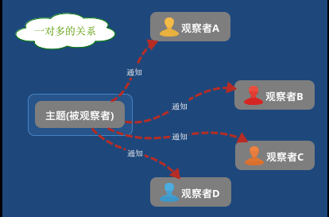
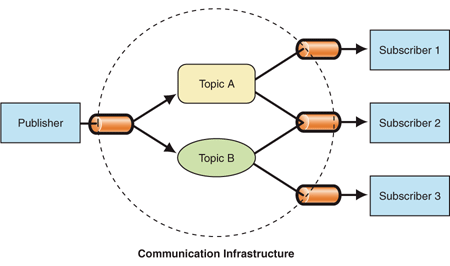
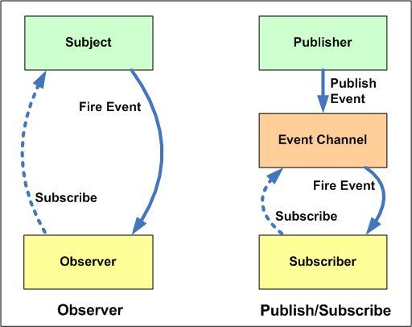
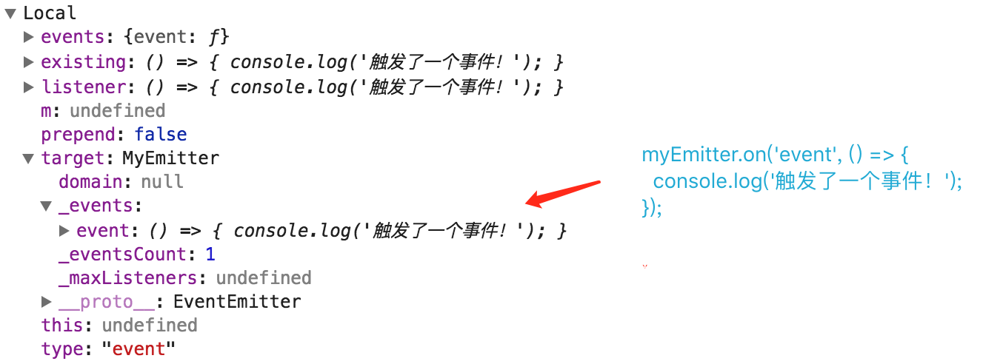

## 深入学习 Node.js EventEmitter

<!-- TOC -->

- [深入学习 Node.js EventEmitter](#深入学习-nodejs-eventemitter)
    - [预备知识](#预备知识)
        - [观察者模式](#观察者模式)
        - [发布/订阅模式](#发布订阅模式)
        - [观察者模式 vs 发布/订阅模式](#观察者模式-vs-发布订阅模式)
    - [Node.js EventEmitter](#nodejs-eventemitter)
        - [EventEmitter 基本使用](#eventemitter-基本使用)
        - [EventEmitter 构造函数](#eventemitter-构造函数)
        - [EventEmitter on() 方法](#eventemitter-on-方法)
        - [EventEmitter removeListener() 方法](#eventemitter-removelistener-方法)
        - [EventEmitter once() 方法](#eventemitter-once-方法)
    - [总结](#总结)
    - [参考资源](#参考资源)

<!-- /TOC -->

### 预备知识

#### 观察者模式

> **观察者模式**是[软件设计模式](https://zh.wikipedia.org/wiki/%E8%BB%9F%E4%BB%B6%E8%A8%AD%E8%A8%88%E6%A8%A1%E5%BC%8F)的一种。在此种模式中，一个目标对象管理所有相依于它的观察者对象，并且在它本身的状态改变时主动发出通知。这通常透过呼叫各观察者所提供的方法来实现。此种模式通常被用来实时事件处理系统。 —— 维基百科

观察者模式，它定义了一种一对多的关系，让多个观察者对象同时监听某一个主题对象，这个主题对象的状态发生变化时就会通知所有的观察者对象，使得它们能够自动更新自己。

我们可以使用日常生活中，期刊订阅的例子来形象地解释一下上面的概念。期刊订阅包含两个主要的角色：期刊出版方和订阅者，它们之间的关系如下：

- 期刊出版方 - 负责期刊的出版和发行工作。
- 订阅者 - 只需执行订阅操作，新版的期刊发布后，就会主动收到通知，如果取消订阅，以后就不会再收到通知。

在观察者模式中也有两个主要角色：主题和观察者，分别对应期刊订阅例子中的期刊出版方和订阅者，它们之间的关系图如下：



观察者模式的优缺点、应用和实现，这里就不详细展开，有兴趣的小伙伴可以阅读本人之前整理的文章[Observable详解 - Observer Pattern](https://segmentfault.com/a/1190000008809168#articleHeader0)。

#### 发布/订阅模式

> 在[软件架构](https://zh.wikipedia.org/wiki/%E8%BD%AF%E4%BB%B6%E6%9E%B6%E6%9E%84)中，**发布-订阅**是一种[消息](https://zh.wikipedia.org/wiki/%E6%B6%88%E6%81%AF)[范式](https://zh.wikipedia.org/wiki/%E8%8C%83%E5%BC%8F)，消息的发送者（称为发布者）不会将消息直接发送给特定的接收者（称为订阅者）。而是将发布的消息分为不同的类别，无需了解哪些订阅者（如果有的话）可能存在。同样的，订阅者可以表达对一个或多个类别的兴趣，只接收感兴趣的消息，无需了解哪些发布者（如果有的话）存在。—— [维基百科](https://zh.wikipedia.org/wiki/%E5%8F%91%E5%B8%83/%E8%AE%A2%E9%98%85)

发布/订阅模式与观察者模式非常类似，它们最大的区别是：发布者和订阅者不知道对方的存在。它们之间需要一个第三方组件，叫做信息中介，它将订阅者和发布者串联起来，它过滤和分配所有输入的消息。换句话说，发布/订阅模式用来处理不同系统组件的信息交流，即使这些组件不知道对方的存在。

那么信息中介是如何过滤消息呢？在发布/订阅模型中，订阅者通常接收所有发布的消息的一个子集。选择接受和处理的消息的过程被称作过滤。有两种常用的过滤形式：基于主题的和基于内容的。

* 在**基于主题**的系统中，消息被发布到主题或命名通道上。订阅者将收到其订阅的主题上的所有消息，并且所有订阅同一主题的订阅者将接收到同样的消息。发布者负责定义订阅者所订阅的消息类别。
* 在**基于内容**的系统中，订阅者定义其感兴趣的消息的条件，只有当消息的属性或内容满足订阅者定义的条件时，消息才会被投递到该订阅者。订阅者需要负责对消息进行分类。

一些系统支持两者的混合：发布者发布消息到主题上，而订阅者将基于内容的订阅注册到一个或多个主题上。基于主题的通信基础结构图如下：




最后我们再来总结一下观察者模式与发布/订阅模式之间的区别。

#### 观察者模式 vs 发布/订阅模式



（图片来源 - [developers-club](http://developers-club.com/posts/270339/)）

观察者模式与发布/订阅模式之间的区别：

* 在观察者模式中，观察者知道 Subject 的存在，Subject 一直保持对观察者进行记录。然而，在发布/订阅模式中，发布者和订阅者不知道对方的存在，它们只有通过信息中介进行通信。
* 在发布订阅模式中，组件是松散耦合的，正好和观察者模式相反。
* 观察者模式大多数时候是同步的，比如当事件触发，Subject 就会去调用观察者的方法。而发布/订阅模式大多数时候是异步的（使用消息队列）。

### Node.js EventEmitter

大多数 Node.js 核心 API 都采用惯用的异步事件驱动架构，其中某些类型的对象（触发器）会周期性地触发命名事件来调用函数对象（监听器）。

例如，[`net.Server`](http://nodejs.cn/api/net.html#net_class_net_server) 对象会在每次有新连接时触发事件；[`fs.ReadStream`](http://nodejs.cn/api/fs.html#fs_class_fs_readstream) 会在文件被打开时触发事件；[流对象](http://nodejs.cn/api/stream.html) 会在数据可读时触发事件。

所有能触发事件的对象都是 `EventEmitter` 类的实例。 这些对象开放了一个 `eventEmitter.on()` 函数，允许将一个或多个函数绑定到会被对象触发的命名事件上。 事件名称通常是驼峰式的字符串，但也可以使用任何有效的 JavaScript 属性名。

**当 `EventEmitter` 对象触发一个事件时，所有绑定在该事件上的函数都被同步地调用**。 监听器的返回值会被丢弃。

#### EventEmitter 基本使用

```javascript
const EventEmitter = require('events');

class MyEmitter extends EventEmitter {}

const myEmitter = new MyEmitter();
myEmitter.on('event', () => {
  console.log('触发了一个事件！');
});

myEmitter.emit('event');
```

以上示例，我们自定义 MyEmitter 类，该类继承于 EventEmitter 类，接着我们通过使用 `new` 关键字创建了 `myEmitter` 实例，然后使用 `on()` 方法监听 event 事件，最后利用 `emit()` 方法触发 event 事件。

小伙伴们，是不是觉得示例很简单。觉得简单就对了，我们就从简单的入手，慢慢深入学习 EventEmitter 类。

#### EventEmitter 构造函数

```javascript
function EventEmitter() {
  EventEmitter.init.call(this);
}

EventEmitter.usingDomains = false;

EventEmitter.prototype._events = undefined;
EventEmitter.prototype._eventsCount = 0; // 事件数
EventEmitter.prototype._maxListeners = undefined; // 最大的监听器数
```

在 EventEmitter 构造函数内部，会调用 `EventEmitter.init` 方法执行初始化操作，`EventEmitter.init` 的具体实现如下：

```javascript
EventEmitter.init = function() {
  if (this._events === undefined ||
      this._events === Object.getPrototypeOf(this)._events) {
    this._events = Object.create(null);
    this._eventsCount = 0;
  }
  this._maxListeners = this._maxListeners || undefined;
};
```

在 EventEmitter.init 内部，会根据条件执行初始化操作，比较重要的这行代码 `this._events = Object.create(null)`，实现过简单发布/订阅模式的小伙伴，估计已经猜到 `_events` 属性的作用了，这里我们就先不继续讨论，我们先来看一下 `on()` 方法。

#### EventEmitter on() 方法

```javascript
EventEmitter.prototype.on = EventEmitter.prototype.addListener;

EventEmitter.prototype.addListener = function addListener(type, listener) {
  return _addListener(this, type, listener, false);
};
```

通过代码我们可以发现 EventEmitter 实例上 `addListener` 和 `on` 的实现是一样的，执行时都是调用 `events.js` 文件内的 `_addListener()` 函数，它的具体实现如下（代码片段）：

```javascript
/**
* 添加事件监听器
* target：EventEmitter 实例
* type：事件类型
* listener：事件监听器
* prepend：是否添加在前面
*/
function _addListener(target, type, listener, prepend) {
  var m;
  var events;
  var existing;

  // 若监听器不是函数对象，则抛出异常
  if (typeof listener !== 'function') {
    const errors = lazyErrors();
    throw new errors.TypeError('ERR_INVALID_ARG_TYPE', 'listener', 'Function');
  }

  events = target._events;
  // 若target._events对象未定义，则使用Object.create创建一个新的对象
  if (events === undefined) {
    events = target._events = Object.create(null);
    target._eventsCount = 0;
  } else {
    // To avoid recursion in the case that type === "newListener"! Before
    // adding it to the listeners, first emit "newListener".
    if (events.newListener !== undefined) {
      target.emit('newListener', type,
                  listener.listener ? listener.listener : listener);

      // Re-assign `events` because a newListener handler could have caused the
      // this._events to be assigned to a new object
      events = target._events;
    }
    existing = events[type]; // 获取type类型保存的对象
  }

  if (existing === undefined) {
    // Optimize the case of one listener. Don't need the extra array object.
    // 优化单个监听器的场景，不需使用额外的数组对象。
    existing = events[type] = listener;
    ++target._eventsCount;
  } else {
    if (typeof existing === 'function') { // 添加type前已有绑定监听器
      // Adding the second element, need to change to array.
      existing = events[type] =
        prepend ? [listener, existing] : [existing, listener];
      // If we've already got an array, just append.
    } else if (prepend) { // 添加到前面
      existing.unshift(listener);
    } else { // 添加到后面
      existing.push(listener);
    }
  }
  return target;
}
```

现在我们来简单总结一下 _addListener() 方法内部的主要流程：

- 验证监听器是否为函数对象。
- 避免类型为 newListener 的事件类型，造成递归调用。
- 优化单个监听器的场景，不需使用额外的数组对象。
- 基于 prepend 参数的值，控制监听器的添加顺序。

这时，相信你已经知道 EventEmitter 实例中 `_events` 属性的作用了，即用来以 Key-Value 的形式来保存指定的事件类型与对应的监听器。具体可以参考下图（myEmitter.on('event', ()=>{} 内部执行情况）：



绑定完事件，如果要派发事件，就可以调用 EventEmitter 实例的 emit() 方法，该方法的实现如下（代码片段）：

```javascript
EventEmitter.prototype.emit = function emit(type, ...args) {
  let doError = (type === 'error'); 

  const events = this._events;

  const handler = events[type]; // 获取type类型对应的处理器

  if (handler === undefined)
    return false;

  // 若事件处理器为函数对象，则使用Reflect.apply进行调用
  if (typeof handler === 'function') { 
    Reflect.apply(handler, this, args);
  } else {
    const len = handler.length;
    const listeners = arrayClone(handler, len);
    for (var i = 0; i < len; ++i)
      Reflect.apply(listeners[i], this, args);
  }

  return true;
};

// 数组浅拷贝
function arrayClone(arr, n) {
  var copy = new Array(n);
  for (var i = 0; i < n; ++i)
    copy[i] = arr[i];
  return copy;
}
```

emit() 方法内部实现还是挺简单的，先根据事件类型获取对应的处理器，然后根据事件处理器的类型，进行进一步处理。需要注意的是，调用处理器是通过 Reflect 对象提供的 `apply()` 方法来实现。

Reflect.apply() 方法的签名如下：

> Reflect.apply(target, thisArgument, argumentsList)

- target —— 目标函数。
- thisArgument —— target 函数调用时绑定的 this 对象。
- argumentsList —— target 函数调用时传入的实参列表，该参数应该是一个类数组的对象。

如果对 Reflect 对象感兴趣的小伙伴，可以参考[MDN - Reflect 对象](https://developer.mozilla.org/zh-CN/docs/Web/JavaScript/Reference/Global_Objects/Reflect)。

到这里前面的简单的示例，我们已经分析完了。我们已经知道通过 EventEmitter 实例的 `on()` 方法可以用来添加事件监听，但有些时候，我们也需要在某些情况下移除对应的监听。针对这种需求，我们就需要利用 EventEmitter 实例的 `removeListener()` 方法了。

#### EventEmitter removeListener() 方法

`removeListener()` 方法最多只会从监听器数组里移除一个监听器实例。 如果任何单一的监听器被多次添加到指定 `type` 的监听器数组中，则必须多次调用 `removeListener()` 方法才能移除每个实例。为了方便一次性移除 `type` 对应的监听器，EventEmitter 为我们提供了 `removeAllListeners()` 方法。

下面我们来看一下 removeListener() 方法的具体实现（代码片段）：

```javascript
// Emits a 'removeListener' event if and only if the listener was removed.
EventEmitter.prototype.removeListener =
    function removeListener(type, listener) {
      var list, events, position, i, originalListener;

      // 若监听器不是函数对象，则抛出异常
      if (typeof listener !== 'function') {
        const errors = lazyErrors();
        throw new errors.TypeError('ERR_INVALID_ARG_TYPE', 'listener',
          'Function');
      }

      events = this._events;
      if (events === undefined)
        return this;

      list = events[type]; // 获取type对应的绑定对象
      if (list === undefined)
        return this;

      if (list === listener || list.listener === listener) {
        if (--this._eventsCount === 0) // 只绑定一个监听器
          this._events = Object.create(null);
        else {
          delete events[type];
          // 若已设置removeListener监听器，则触发removeListener事件
          if (events.removeListener) 
            this.emit('removeListener', type, list.listener || listener);
        }
      } else if (typeof list !== 'function') { // 包含多个监听器
        position = -1;

        for (i = list.length - 1; i >= 0; i--) { // 获取需移除listener对应的索引值
          if (list[i] === listener || list[i].listener === listener) {
            originalListener = list[i].listener;
            position = i;
            break;
          }
        }

        if (position < 0)
          return this;

        if (position === 0)
          list.shift();
        else {
          if (spliceOne === undefined)
            spliceOne = require('internal/util').spliceOne;
          // 调用内置的spliceOne移除position对应的值
          spliceOne(list, position);
        }

        if (list.length === 1)
          events[type] = list[0];

        if (events.removeListener !== undefined)
          this.emit('removeListener', type, originalListener || listener);
      }

      return this;
    };
```

通过代码我们发现在调用 `removeListener()` 方法时，若 type 事件类型上绑定多个事件处理器，那么内部处理程序会先根据 `listener` 事件处理器，查找该事件处理器对应的索引值，若该索引值大于 0，则会调用 Node.js 内部工具库提供的 spliceOne() 方法，移除对应的事件处理器。为什么不直接利用 Array#splice() 方法呢？官方的回答是 spliceOne() 方法的执行速度比 Array#splice() 快大约 1.5 倍。

spliceOne() 方法具体实现如下：

```javascript
// About 1.5x faster than the two-arg version of Array#splice().
function spliceOne(list, index) {
  for (var i = index, k = i + 1, n = list.length; k < n; i += 1, k += 1)
    list[i] = list[k];
  list.pop(); // 把最后面的空位移除
}
```

感兴趣的小伙伴，可以实际对比一下 Array#splice() 与 spliceOne() 的性能哈。最后我们来介绍一下 EventEmitter 另一个常用的方法 once()。

#### EventEmitter once() 方法

有些时候，对于一些特殊的事件类型，我们只需执行一次事件处理器，这时我们就可以使用 once() 方法：

```javascript
const myEmitter = new MyEmitter();
let m = 0;
myEmitter.once('event', () => {
  console.log(++m);
});
myEmitter.emit('event'); // 打印: 1
myEmitter.emit('event'); // 无输出
```

以上代码很简单，废话不多说，我们直接看一下 once 函数的具体实现：

```javascript
EventEmitter.prototype.once = function once(type, listener) {
  if (typeof listener !== 'function') {
    const errors = lazyErrors();
    throw new errors.TypeError('ERR_INVALID_ARG_TYPE', 'listener', 'Function');
  }
  this.on(type, _onceWrap(this, type, listener));
  return this;
};
```

通过源码可以发现，once() 函数内部也是通过调用 `on()` 方法来绑定事件监听器。特别之处是，内部使用 `_onceWrap` 函数对 listener 函数进行进一步封装。那我们只能继续发掘 `_onceWrap` 函数，该函数的实现如下：

```javascript
function _onceWrap(target, type, listener) {
  var state = { fired: false, wrapFn: undefined, target, type, listener };
  var wrapped = onceWrapper.bind(state); // 绑定this上下文
  wrapped.listener = listener;
  state.wrapFn = wrapped;
  return wrapped;
}
```

在 _onceWrap 函数内部，我们创建了一个 state 对象，该对象有一个 `fired` 属性，用来标识是否已触发，其默认值是 false。一开始还以为内部实现都包含在 _onceWrap 函数内，没想到竟然又来了个 onceWrapper 函数对象。为了能够揭开 once() 的神秘面纱，只能继续前进了。onceWrapper 函数的实现如下：

```javascript
function onceWrapper(...args) {
  if (!this.fired) { 
    this.target.removeListener(this.type, this.wrapFn);
    this.fired = true;
    Reflect.apply(this.listener, this.target, args);
  }
}
```

守得云开见月明，终于见到 onceWrapper 函数的庐山真面目。在函数体中，若发现事件处理器未被调用，则先移除事件监听器并设置 fired 字段值为 true，然后利用之前介绍的 Reflect.apply() 方法调用 type 事件类型，对应的事件处理器。至此，EventEmitter 的探索之旅，就落下的帷幕，想继续了解 EventEmitter 的小伙伴，可以查阅官方文档或 EventEmitter 对应的源码。

### 总结

为了能够更好地理解 EventEmitter 的设计思想，首先我们介绍了观察者模式与发布/订阅模式，然后对比了它们之间的区别。接着我们以一个简单的示例为切入点，介绍了 EventEmitter 的 on()、emit()、removeListener() 和 once() 方法的使用及内部实现。

如果小伙伴们也对 EventEmitter 源码感兴趣，建议采用阅读和调试相结合的方式，进行源码学习。详细的调试方式，请参考 [Debugging Node.js Apps](https://nodejs.org/en/docs/inspector/) 文章。

### 参考资源

* [observer-vs-pub-sub-pattern](https://hackernoon.com/observer-vs-pub-sub-pattern-50d3b27f838c)


* [Node.js 中文文档 - events](http://nodejs.cn/api/events.html)
