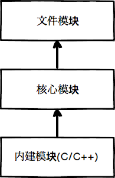
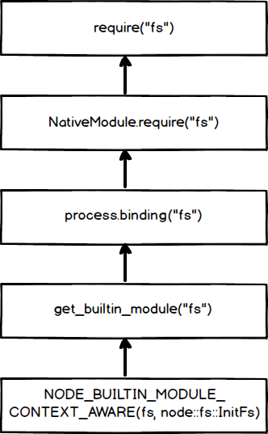

## 深入学习 Node.js Module 进阶篇

<!-- TOC -->

- [深入学习 Node.js Module 进阶篇](#深入学习-nodejs-module-进阶篇)
    - [模块导入](#模块导入)
        - [JavaScript 模块导入](#javascript-模块导入)
        - [C、C++ 模块导入](#cc-模块导入)
        - [JSON 文件导入](#json-文件导入)
    - [核心模块](#核心模块)
        - [JavaScript 核心模块的编译过程](#javascript-核心模块的编译过程)
        - [C、C++ 核心模块的编译过程](#cc-核心模块的编译过程)
    - [总结](#总结)
    - [参考资源](#参考资源)

<!-- /TOC -->

### 模块导入

在 Node 中，模块分为两类：

- Node 提供的模块，称为核心模块：在 Node 源代码的编译过程中，编译进了二进制执行文件。在 Node 进程启动时，部分核心模块就被直接加载进内存中，所以这部分核心模块引入时，文件定位和编译执行这两个步骤可以省略掉，并且在路径分析中优先判断，所以它的加载速度是最快的。
- 用户编写的模块，称为文件模块：在运行时动态加载，需要完整的路径分析、文件定位、编译执行过程，速度比核心模块慢。

而导入模块时，需要经历如下 3 个步骤：

- 路径分析：分析 . 或 .. 开始的相对路径文件模块、以 / 开始的绝对路径文件模块、非路径形式的文件模块，如自定义的 connect 模块

- 文件定位：文件扩展名的分析、目录和包的处理。

  - 扩展名分析：Node 会按 .js、.json、.node 的次序补足扩展名，依次尝试。

  - 目录分析：require() 通过分析文件扩展名之后，可能没有查找到对应文件，但却得到一个目录，这在引入自定义模块和逐个模块路径进行查找时经常会出现，此时 Node 会将目录当做一个包来处理。

  - 包处理：Node 对 CommonJS 包规范进行了一定程度的支持。首先，Node 在当前目录下查找 package.json （CommonJS 包规范定义的包描述文件），通过 JSON.parse() 解析出包描述对象，从中取出 main 属性指定的文件名进行定位。如果文件名缺少扩展名，将会进入扩展名分析的步骤。

    而如果 main 属性指定的文件名错误，或者压根没有 package.json 文件，Node 会将 index 当做默认文件名，依次查找 index.js、index.json、index.node。

- 编译执行

> 不论是核心模块还是文件模块，require() 方法对相同模块的二次加载都一律采用缓存优先的方式，这是第一优先级。不同之处在于核心模块的缓存检查优先于文件模块的缓存检查。

#### JavaScript 模块导入

回到 CommonJS 模块规范，我们知道每个模块文件存在着 require、exports、module 这三个变量，但是它们在模块文件中并没有定义，那么从何而来呢？甚至在 Node 的 API 文档中，我们知道每个模块中还有 `__filename`、`__dirname` 这两个变量的存在，它们又是从何而来的呢？

事实上，在编译的过程中，Node 对获取的 JavaScript 文件内容进行了头尾包装。包装之后的代码会通过 vm 原生模块的 `runInThisContext()` 方法执行（类似 eval，只是具有明确上下文，不污染全局），返回一个具体的 function 对象。最后，将当前模块对象的 exports 属性、require 方法、module（模块对象自身），以及在文件定位中得到的完整文件路径和文件目录作为参数传递给这个 function 执行。

```javascript
// Native extension for .js
Module._extensions['.js'] = function(module, filename) {
  var content = fs.readFileSync(filename, 'utf8');
  module._compile(internalModule.stripBOM(content), filename);
};
```

#### C、C++ 模块导入

Node 调用 process.dlopen() 方法进行加载和执行。在 Node 的架构下，dlopen() 方法在 Windows 和 *nix 平台下分别有不同的实现，通过 libuv 兼容层进行了封装。

实际上，.node 的模块文件并不需要编译，因为它是编写 C/C++ 模块之后编译生成的，所以这里只有加载和执行的过程。在执行的过程中，模块的 exports 对象与 .node 模块产生联系，然后返回给调用者。

```javascript
//Native extension for .node
Module._extensions['.node'] = function(module, filename) {
  return process.dlopen(module, path.toNamespacedPath(filename));
};
```

#### JSON 文件导入

Node 利用 fs 模块同步读取 JSON 文件的内容之后，调用 JSON.parse() 方法得到对象，然后将它赋值给模块对象的 exports，以供外部调用。

```json
// Native extension for .json
Module._extensions['.json'] = function(module, filename) {
  var content = fs.readFileSync(filename, 'utf8');
  try {
    module.exports = JSON.parse(internalModule.stripBOM(content));
  } catch (err) {
    err.message = filename + ': ' + err.message;
    throw err;
  }
};
```

### 核心模块

前面提到，Node 的核心模块在编译成可执行文件的过程中被编译进了二进制文件。核心模块其实分为 C/C++ 编写的和 JavaScript 编写的两部分，其中 C/C++ 文件存放在 Node 项目的 src 目录下，JavaScript 文件存放在 lib 目录下。

#### JavaScript 核心模块的编译过程

在编译所有 C/C++ 文件之前，编译程序需要将所有的 JavaScript 模块文件编译为 C/C++ 代码，此时是否直接将其编译为可执行代码了呢？其实在 Node 在编译的时候，会利用 V8 附带的 js2c.py 工具，将所有内置的 JavaScript 文件（`lib/*.js 和 deps/*.js`）转换成 C++ 里的数组，生成 node_javascript.cc 文件。

- JavaScript 核心模块转存为 C++ 文件

```c++
#include "node.h"
#include "node_javascript.h"
#include "v8.h"
#include "env.h"
#include "env-inl.h"

namespace node {
  
static const uint8_t raw_internal_bootstrap_node_key[] = { 105,110,116,101,114,110,97,108,47,98,111,111,116,115,116,114,97,112,95,110,
111,100,101 }; // internal/bootstrap_node
static struct : public v8::String::ExternalOneByteStringResource {
  const char* data() const override {
    return reinterpret_cast<const char*>(raw_internal_bootstrap_node_key);
  }
  size_t length() const override { return arraysize(raw_internal_bootstrap_node_key); }
  void Dispose() override { /* Default calls `delete this`. */ }
  v8::Local<v8::String> ToStringChecked(v8::Isolate* isolate) {
    return v8::String::NewExternalOneByte(isolate, this).ToLocalChecked();
  }
} internal_bootstrap_node_key;

// lib/internal/bootstrap_node.js源码
static const uint8_t raw_internal_bootstrap_node_value[] = [47,47,32,72,101,108,...]
```

在这个过程中，JavaScript 代码以字节数组的形式存储在 node 命名空间中，是不可直接执行的。在启动 Node 进程时，JavaScript 代码直接加载进内存中。在加载的过程中，JavaScript 核心模块经历标识符分析后直接定位到内存中，比普通的文件模块从磁盘中一处一处查找要快很多。

- 编译 JavaScript 核心模块

lib 目录下的所有模块文件也没有定义 require、module、exports 这些变量。在引入 JavaScript 核心模块的过程中，也经历了头尾包装的过程，然后才执行和导出了 exports 对象。

```javascript
NativeModule.wrap = function(script) {
  return NativeModule.wrapper[0] + script + NativeModule.wrapper[1];
};

NativeModule.wrapper = [
  '(function (exports, require, module, internalBinding, process) {',
  '\n});'
];
```

此外核心模块与文件模块有区别的地方在于，获取源代码的方式（核心模块是从内存中加载的）以及缓存执行结果的位置。

JavaScript 核心模块的定义如下面代码所示，源文件通过 `process.binding('natives')` 取出，编译成功的模块缓存到 `NativeModule._cache` 对象上，文件模块则缓存到 `Module._cache` 对象上：

```javascript
function NativeModule(id) {
  this.filename = `${id}.js`;
  this.id = id;
  this.exports = {};
  this.loaded = false;
  this.loading = false;
}

NativeModule._source = process.binding('natives');
NativeModule._cache = {};
```

#### C、C++ 核心模块的编译过程

在核心模块中，有些模块全部由 C/C++ 编写，有些模块则由 C/C++ 完成核心部分，其他部分则由 JavaScript 实现包装或者向外导出，以满足性能需求。后面这种 C++ 模块主内完成核心，JavaScript 主外实现封装的模式是 Node 能够提高性能的常见方式。通常，脚本语言的开发速度优于静态语言，但是其性能则弱于静态语言。而 Node 的这种复合模式可以在开发速度和性能之间找到平衡点。

这里我们将那些由纯 C/C++ 编写的部分统一称为内建模块，因为它们通常不被用户直接调用。Node 的 buffer、crypto、evals、fs、os 等模块都是部分通过 C/C++ 编写的。

- 内建模块的组织形式

在 Node 中，内建模块的内部结构定义如下：

```c
struct node_module {
  int nm_version;
  // NM_F_BUILTIN  = 1 << 0, NM_F_LINKED = 1 << 1, NM_F_INTERNAL = 1 << 2
  unsigned int nm_flags;  
  void* nm_dso_handle;
  const char* nm_filename;
  node::addon_register_func nm_register_func;
  node::addon_context_register_func nm_context_register_func;
  const char* nm_modname;
  void* nm_priv;
  struct node_module* nm_link;
};
```

每一个内建模块在定义之后，会通过 `NODE_BUILTIN_MODULE_CONTEXT_AWARE` 宏将模块定义到 node 命名空间中，模块的初始化方法挂载到 node_module 结构体的 `nm_context_register_func` 成员上。

接下来我们以 `node_buffer.cc` 为例，来简单分析一下这个过程：

```c++
void Initialize(Local<Object> target,
                Local<Value> unused,
                Local<Context> context) {
  Environment* env = Environment::GetCurrent(context);

  env->SetMethod(target, "setupBufferJS", SetupBufferJS);
  env->SetMethod(target, "createFromString", CreateFromString);

  env->SetMethod(target, "byteLengthUtf8", ByteLengthUtf8);
  env->SetMethod(target, "copy", Copy);
  // ...
  env->SetMethod(target, "encodeUtf8String", EncodeUtf8String);

  target->Set(env->context(),
              FIXED_ONE_BYTE_STRING(env->isolate(), "kMaxLength"),
              Integer::NewFromUnsigned(env->isolate(), kMaxLength)).FromJust();

  target->Set(env->context(),
              FIXED_ONE_BYTE_STRING(env->isolate(), "kStringMaxLength"),
              Integer::New(env->isolate(), String::kMaxLength)).FromJust();
}

NODE_BUILTIN_MODULE_CONTEXT_AWARE(buffer, node::Buffer::Initialize)
```

通过观察以上源码，我可以知道 `node::Buffer::Initialize` 方法，用于导出 `node_buffer.cc` 内部的 C++ 方法，以供 JavaScript 端调用。而上面的 NODE_BUILTIN_MODULE_CONTEXT_AWARE 宏定义如下：

```c++
#define NODE_BUILTIN_MODULE_CONTEXT_AWARE(modname, regfunc)                   \
  NODE_MODULE_CONTEXT_AWARE_CPP(modname, regfunc, nullptr, NM_F_BUILTIN)
  
#define NODE_MODULE_CONTEXT_AWARE_CPP(modname, regfunc, priv, flags)          \
  static node::node_module _module = {                                        \
    NODE_MODULE_VERSION,                                                      \
    flags,                                                                    \
    nullptr,                                                                  \
    __FILE__,                                                                 \
    nullptr,                                                                  \
    (node::addon_context_register_func) (regfunc),                            \
    NODE_STRINGIFY(modname),                                                  \
    priv,                                                                     \
    nullptr                                                                   \
  };                                                                          \
  void _register_ ## modname() {                                              \
    node_module_register(&_module);                                           \
  }
```

定义完内建模块后，Node 会通过 `NODE_BUILTIN_MODULES` 宏，进行内建模块的注册， `NODE_BUILTIN_MODULES` 宏的定义如下：

```c++
#define NODE_BUILTIN_MODULES(V)                                               \
  NODE_BUILTIN_STANDARD_MODULES(V)                                            \
  NODE_BUILTIN_OPENSSL_MODULES(V)                                             \
  NODE_BUILTIN_ICU_MODULES(V)
```

其中 NODE_BUILTIN_STANDARD_MODULES 中注册的主要模块有：

- async_wrap
- fs
- http_parser
- module_wrap
- stream_wrap
- timer_wrap

通过查看源码，我们发现在 `node.cc` 中会调用 NODE_BUILTIN_MODULES 宏：

```c++
// This is used to load built-in modules. Instead of using
// __attribute__((constructor)), we call the _register_<modname>
// function for each built-in modules explicitly in
// node::RegisterBuiltinModules(). This is only forward declaration.
// The definitions are in each module's implementation when calling
// the NODE_BUILTIN_MODULE_CONTEXT_AWARE.
#define V(modname) void _register_##modname();
  NODE_BUILTIN_MODULES(V)
#undef V
```

是不是感觉有点晕了，我们赶紧来简单梳理一下 buffer 模块的注册流程：

```
NODE_BUILTIN_MODULES(V) 
	NODE_BUILTIN_STANDARD_MODULES                                                           
       V(buffer) // #define V(modname) void _register_##modname();
          node_module_register(&_module);  
```

接着我们继续看一下 node_module_register() 方法：

```c++
extern "C" void node_module_register(void* m) {
  struct node_module* mp = reinterpret_cast<struct node_module*>(m);

  if (mp->nm_flags & NM_F_BUILTIN) {
    mp->nm_link = modlist_builtin;
    modlist_builtin = mp;
  } else if (mp->nm_flags & NM_F_INTERNAL) {
    mp->nm_link = modlist_internal;
    modlist_internal = mp;
  } else if (!node_is_initialized) {
    // "Linked" modules are included as part of the node project.
    // Like builtins they are registered *before* node::Init runs.
    mp->nm_flags = NM_F_LINKED;
    mp->nm_link = modlist_linked;
    modlist_linked = mp;
  } else {
    modpending = mp;
  }
}
```

那么如何获取已注册的内建模块呢？这里我们可以利用 `node.cc` 文件中的 get_builtin_module 方法来获取指定的模块，get_builtin_module 方法的具体实现如下：

```C++
node_module* get_builtin_module(const char* name) {
  return FindModule(modlist_builtin, name, NM_F_BUILTIN);
}
```

这时我们来简单总结一下内建模块的优势：首先，它们本身由 C/C++ 编写，性能上优于脚本语言；其次，在进行文件编译时，它们被编译进二进制文件。一旦 Node 开始执行，它们被直接加载进内存中，无需再次做标识符定位、文件定位、编译等过程，直接就可执行。

- 内建模块的导出

在 Node 的所有模块类型中，存在着如下图所示的一种依赖层级关系，即文件模块可能会依赖核心模块，核心模块可能会依赖内建模块。



**通常，不推荐文件模块直接调用内建模块。如需调用，直接调用核心模块即可，因为核心模块中基本都封装了内建模块**。那么内建模块是如何将内部的变量或方法导出，以供外部 JavaScript 核心模块调用的呢？

Node 在启动时，会生成一个全局变量 process，并提供 `Binding()` 方法来加载内建模块。`Binding()` 的实现代码在 `src/node.cc` 中，具体如下所示：

```c++
static void Binding(const FunctionCallbackInfo<Value>& args) {
  Environment* env = Environment::GetCurrent(args);

  CHECK(args[0]->IsString());

  Local<String> module = args[0].As<String>();
  node::Utf8Value module_v(env->isolate(), module);

  // 获取内建模块，即C++实现的原生模块
  node_module* mod = get_builtin_module(*module_v);
  Local<Object> exports;
  if (mod != nullptr) {
    // 若存在则进行模块初始化
    exports = InitModule(env, mod, module);
  } else if (!strcmp(*module_v, "constants")) { // 获取常量信息
    exports = Object::New(env->isolate());
    CHECK(exports->SetPrototype(env->context(),
      Null(env->isolate())).FromJust());
    DefineConstants(env->isolate(), exports);
  } else if (!strcmp(*module_v, "natives")) {
    exports = Object::New(env->isolate());
    DefineJavaScript(env, exports);  // 实现把C++方法导出到JavaScript上下文中
  } else {
    return ThrowIfNoSuchModule(env, *module_v);
  }

  args.GetReturnValue().Set(exports);
}

// 初始化内建模块，调用nm_context_register_func()方法执行模块注册操作
static Local<Object> InitModule(Environment* env,
                                 node_module* mod,
                                 Local<String> module) {
  // 新建exports对象
  Local<Object> exports = Object::New(env->isolate());
  // Internal bindings don't have a "module" object, only exports.
  CHECK_EQ(mod->nm_register_func, nullptr);
  CHECK_NE(mod->nm_context_register_func, nullptr);
  Local<Value> unused = Undefined(env->isolate());
  // 调用模块的初始化方法：如node::Buffer::Initialize
  mod->nm_context_register_func(exports,
                                unused,
                                env->context(),
                                mod->nm_priv);
  return exports;
}
```

在加载内建模块时，我们先创建一个 exports 空对象，然后调用 get_builtin_module() 方法取出内建模块对象，通过执行 `nm_context_register_func()` 填充 exports 对象，最后将 exports 对象按模块名缓存，并返回给调用方完成导出。

**这个方法不仅可以导出内建方法，还能导出一些别的内容。前面提到的 JavaScript 核心文件被转换为 C/C++ 数组存储后，便是通过 `process.binding('natives')` 取出放置在 NativeModule._source 中**：

```c++
NativeModule._source = process.binding('natives');
```

该方法将通过 js2c.py 工具转换出的字节数组取出，然后重新转换为普通字符串，以对 JavaScript 核心模块进行编译和执行，最后我们来看一下核心模块的引入流程。

- 核心模块的引入流程

从下图所示的 fs 原生模块的引入流程可以看到，为了符合 CommonJS 模块规范，从 JavaScript 到 C/C++ 的过程相当复杂的，它要经历 C/C++ 层面的内建模块定义、JavaScript 核心模块的定义和引入以及（JavaScript）文件模块层面的引入。但是对于用户而言，require() 十分简洁友好。



NativeModule.require

```javascript
NativeModule.require = function(id) {
    const cached = NativeModule.getCached(id);
    if (cached && (cached.loaded || cached.loading)) {
      return cached.exports;
    }

    moduleLoadList.push(`NativeModule ${id}`);

    const nativeModule = new NativeModule(id);

    nativeModule.cache();
    nativeModule.compile();

    return nativeModule.exports;
};
```

NativeModule.prototype.compile

```javascript
NativeModule.prototype.compile = function() {
    /**
     * NativeModule._source = process.binding('natives');
     * NativeModule.getSource = function(id) {
     *   return NativeModule._source[id];
     * };
     **/
    let source = NativeModule.getSource(this.id);
    source = NativeModule.wrap(source);

    this.loading = true;

    try {
      const fn = runInThisContext(source, {
        filename: this.filename,
        lineOffset: 0,
        displayErrors: true
      });
      const requireFn = this.id.startsWith('internal/deps/') ?
        NativeModule.requireForDeps :
        NativeModule.require;
      fn(this.exports, requireFn, this, internalBinding, process);

      this.loaded = true;
    } finally {
      this.loading = false;
    }
};
```

node_javascript.cc -> fs

```c++
// NativeModule.getSource('fs') -> 返回uint8_t raw_fs_value[]的值;
static const uint8_t raw_fs_key[] = { 102,115 }; // fs
static struct : public v8::String::ExternalOneByteStringResource {
  const char* data() const override {
    return reinterpret_cast<const char*>(raw_fs_key);
  }
  size_t length() const override { return arraysize(raw_fs_key); }
  void Dispose() override { /* Default calls `delete this`. */ }
  v8::Local<v8::String> ToStringChecked(v8::Isolate* isolate) {
    return v8::String::NewExternalOneByte(isolate, this).ToLocalChecked();
  }
} fs_key;

static const uint8_t raw_fs_value[] = {  // lib/fs.js 文件内容
 47,47,32,67,111,112,121,114,105,103,104,116,32,74,111,121,101,110,116,44,...
}
```

lib/fs.js

```javascript
const binding = process.binding('fs');
const fs = exports;

fs.access = function(path, mode, callback) {
  if (typeof mode === 'function') {
    callback = mode;
    mode = fs.F_OK;
  }

  path = getPathFromURL(path);
  validatePath(path);

  mode = mode | 0;
  var req = new FSReqWrap();
  req.oncomplete = makeCallback(callback);
  binding.access(pathModule.toNamespacedPath(path), mode, req);
};
```

process.binding

```c++
static void Binding(const FunctionCallbackInfo<Value>& args) {
  Environment* env = Environment::GetCurrent(args);

  CHECK(args[0]->IsString());

  Local<String> module = args[0].As<String>();
  node::Utf8Value module_v(env->isolate(), module);

  node_module* mod = get_builtin_module(*module_v);
  Local<Object> exports;
  if (mod != nullptr) {
    exports = InitModule(env, mod, module);
  }
  // ...
  args.GetReturnValue().Set(exports);
}
```

node_file.cc

```c++
void InitFs(Local<Object> target,
            Local<Value> unused,
            Local<Context> context,
            void* priv) {
  Environment* env = Environment::GetCurrent(context);

  env->SetMethod(target, "access", Access);
  env->SetMethod(target, "close", Close);
  env->SetMethod(target, "open", Open);
  // ...
}

NODE_BUILTIN_MODULE_CONTEXT_AWARE(fs, node::fs::InitFs)
```

### 总结

这篇文章我们首先介绍了 Node.js 模块导入的相关知识，之后我们进一步介绍了 JavaScript 模块与 C/C++ 模块的编译过程，最后我们以导入 fs 模块为例，简单介绍了核心模块的引入流程。文中涉及较多的 C/C++ 代码，小伙伴们可以选择性阅读。另外，由于本人也不是很熟悉 C/C++，如有表述不当的地方请大家多见谅。

### 参考资源

* 深入浅出 Node.js

