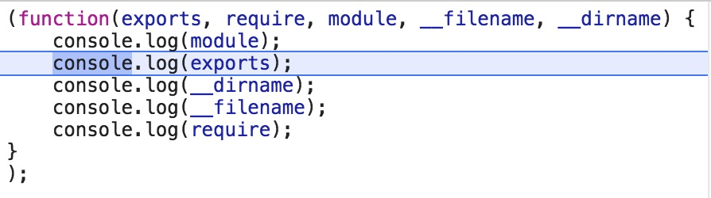

## 深入学习 Node.js Module

<!-- TOC -->

- [深入学习 Node.js Module](#深入学习-nodejs-module)
    - [预备知识](#预备知识)
        - [CommonJS 规范](#commonjs-规范)
            - [示例](#示例)
        - [Node.js 模块分类](#nodejs-模块分类)
        - [module 对象](#module-对象)
        - [Node.js vm](#nodejs-vm)
            - [vm.runInThisContext(code[, options])](#vmruninthiscontextcode-options)
            - [示例](#示例-1)
    - [Node.js Module](#nodejs-module)
        - [Module 基本使用](#module-基本使用)
        - [模块中的 module、exports、`__dirname`、`__filename` 和 require 来自何方？](#模块中的-moduleexports__dirname__filename-和-require-来自何方)
        - [module.exports 与 exports 有什么区别？](#moduleexports-与-exports-有什么区别)
        - [模块出现循环依赖了，会出现死循环么？](#模块出现循环依赖了会出现死循环么)
        - [require 函数支持导入哪几类文件？](#require-函数支持导入哪几类文件)
        - [require 函数执行的主要流程是什么？](#require-函数执行的主要流程是什么)
        - [从 `node_modules` 目录加载](#从-node_modules-目录加载)
    - [总结](#总结)
    - [参考资源](#参考资源)

<!-- /TOC -->

### 预备知识

#### CommonJS 规范

Node.js 遵循 [CommonJS规范](http://wiki.commonjs.org/wiki/CommonJS)，该规范的核心思想是允许模块通过 `require` 方法来**同步加载所要依赖的其他模块**，然后通过 `exports` 或 `module.exports` 来导出需要暴露的接口。CommonJS 规范是为了解决 JavaScript 的作用域问题而定义的模块形式，可以使每个模块它自身的命名空间中执行。

##### 示例

add.js

```javascript
module.exports = (a, b) => a + b;
```

calculate.js

```javascript
const add = require("./add");
console.log("Result: ", add(2, 3));
```

CommonJS 也有浏览器端的实现，其原理是现将所有模块都定义好并通过 `id` 索引，这样就可以方便的在浏览器环境中解析了，可以参考 [require1k](https://github.com/Stuk/require1k) 和 [tiny-browser-require](https://github.com/ruanyf/tiny-browser-require) 的源码来理解其解析（resolve）的过程。

#### Node.js 模块分类

在 Node.js 中包含以下几类模块：

- builtin module: Node.js 中以 C++ 形式提供的模块，如 tcp_wrap、contextify 等
- constants module: Node.js 中定义常量的模块，用来导出如 signal，openssl 库、文件访问权限等常量的定义。如文件访问权限中的 O_RDONLY，O_CREAT、signal 中的 SIGHUP，SIGINT 等。
- native module: Node.js 中以 JavaScript 形式提供的模块，如 http、https、fs 等。有些 native module 需要借助于 builtin module 实现背后的功能。**如对于 native 模块 buffer , 还是需要借助 builtin node_buffer.cc 中提供的功能来实现大容量内存申请和管理，目的是能够脱离 V8 内存大小使用限制**。
- 3rd-party module: 以上模块可以统称 Node.js 内建模块，除此之外为第三方模块，典型的如 express 模块。

#### module 对象

每个模块内部，都有一个 `module` 对象，代表当前模块。它有以下属性。

- `module.id` 模块的识别符，通常是带有绝对路径的模块文件名。
- `module.filename` 模块的文件名，带有绝对路径。
- `module.loaded` 返回一个布尔值，表示模块是否已经完成加载。
- `module.parent` 返回一个对象，表示调用该模块的模块。
- `module.children` 返回一个数组，表示该模块要用到的其他模块。
- `module.exports` 表示模块对外输出的值。

#### Node.js vm

`vm` 模块提供了一系列 API 用于在 V8 虚拟机环境中编译和运行代码。JavaScript 代码可以被编译并立即运行，或编译、保存然后再运行。

##### vm.runInThisContext(code[, options])

`vm.runInThisContext() ` 在当前的`global` 对象的上下文中编译并执行 `code`，最后返回结果。运行中的代码无法获取本地作用域，但可以获取当前的 `global` 对象。

##### 示例

```javascript
const vm = require('vm');
let localVar = 'initial value';

const vmResult = vm.runInThisContext('localVar = "vm";');
console.log('vmResult:', vmResult);
console.log('localVar:', localVar);

const evalResult = eval('localVar = "eval";');
console.log('evalResult:', evalResult);
console.log('localVar:', localVar);

// vmResult: 'vm', localVar: 'initial value'
// evalResult: 'eval', localVar: 'eval'
```

正因 `vm.runInThisContext()` 无法获取本地作用域，故 `localVar` 的值不变。相反，[`eval()`](https://developer.mozilla.org/en-US/docs/Web/JavaScript/Reference/Global_Objects/eval) 确实能获取本地作用域，所以`localVar`的值被改变了。

### Node.js Module

Node.js 有一个简单的模块加载系统。 在 Node.js 中，文件和模块是一一对应的（每个文件被视为一个独立的模块）。废话不多说，小伙伴们让我们一起开启 Node.js Module 的探索之旅吧，这次旅程我们会带着以下问题：

* 模块中的 module、exports、`__dirname`、`__filename` 和 require 来自何方？
* module.exports 与 exports 有什么区别？
* 模块出现循环依赖了，会出现死循环么？
* require 函数支持导入哪几类文件？
* require 函数执行的主要流程是什么？

在这次旅程结束后，希望小伙伴对上述的问题，能够有一个较为清楚的认识。

#### Module 基本使用

foo.js 模块

```javascript
const circle = require('./circle.js');
console.log(`半径为 4 的圆的面积是 ${circle.area(4)}`);
```

circle.js 模块

```javascript
const { PI } = Math;

exports.area = (r) => PI * r ** 2;
exports.circumference = (r) => 2 * PI * r;
```

`circle.js` 模块导出了 `area()` 和 `circumference()` 两个函数。 通过在特殊的 `exports` 对象上指定额外的属性，函数和对象可以被添加到模块的根部。

在 `circle.js` 文件中，我们使用了特殊的 `exports` 对象。其实除了 `exports` 之外，在模块中我们还可以 module、`__dirname`、`__filename` 和 require 这些对象，那它们是从哪里来的呢？好的，我们来解答第一个问题。

#### 模块中的 module、exports、`__dirname`、`__filename` 和 require 来自何方？

当然首先我要先知道它们是什么，这里我们新建一个模块 `module-var.js`，输入以下内容：

```javascript
console.log(module);
console.log(exports);
console.log(__dirname);
console.log(__filename);
console.log(require);
```

执行完以上代码，控制台的输出如下（忽略输出对象中的大部分属性）：

```shell
Module { -------------------------------------------------> module
  id: '.',
  exports: {},
  paths: [] // 模块查找路径
}
     
{}  ------------------------------------------------->  exports

/Users/fer/VSCProjects/learn-node/module -----------------------------> __dirname

/Users/fer/VSCProjects/learn-node/module/module-var.js -----------------> __filename

{ [Function: require] -------------------------------------------------> require
  resolve: [Function: resolve],
  main: Module { } // Module对象
}
```

通过控制台的输出值，我们可以清楚地看出每个变量的值。这里先不细究它们，我们先来调查一下它们的来源。

> CommonJS 规范是为了解决 JavaScript 的作用域问题而定义的模块形式，可以使每个模块它自身的命名空间中执行。

那么 CommonJS 规范是如何解决 JavaScript 的作用域问题，并让每个模块在自身的命名空间中执行呢？不知道小伙伴们是否还记得，在前端的模块方案出来之前，为了避免污染变量污染，我们通过以下方式来创建独立的运行空间：

```javascript
(function(global){
  // some code
})(window)
```

那么 Node.js 是不是也是通过这种方式来解决作用域问题和代码封装呢？

俗话说眼见为实，我们输入 `node --inspect-brk module-var.js` 命令，调试一下前面创建的 `module-var.js` 文件：

通过上图我们可以发现，`module-var.js` 文件中定义的内容，以 `(function(){})` 这种形式被包装了。这里，我们就清楚了，模块中的 module、exports、`__dirname`、`__filename` 和 require 这些对象都是函数的输入参数，在调用包装后的函数时传入。这时第一个问题先告一段落，我们继续探究第二个问题。

#### module.exports 与 exports 有什么区别？

先不急着解释它们之间的区别，我们先来看一行代码：

```javascript
console.log(module.exports === exports);
```

运行完上面的代码，控制台会输出 `true`。那好，我们继续往下看：

```javascript
exports.id = 1; // 方式一：可以正常导出
exports = { id: 1 }; // 方式二：无法正常导出
module.exports = { id: 1 }; // 方式三：可以正常导出
```

为什么方式二无法正常导出呢？让我们回顾一下运行 `module-var.js` 文件时， `module` 和 `exports` 的输出结果：

```
Module { -------------------------------------------------> module
  id: '.',
  exports: {},
  paths: [] // 模块查找路径
}
     
{}  ------------------------------------------------->  exports
```

如果 `module.exports === exports` 执行的结果为 true，那么表示模块中的 exports 变量与 module.exports 属性是指向同一个对象。**当使用方式二 `exports = { id: 1 }` 的方式会改变 exports 变量的指向，这时与module.exports 属性指向不同的变量，而当我们导入某个模块时，是导入 module.exports 属性指向的对象**，具体原因后面会细说。

希望通过上面的分析，小伙伴们能够清晰地了解 module.exports 与 exports 之间的区别和联系。接下来，我们继续第三个问题。

#### 模块出现循环依赖了，会出现死循环么？

首先我们先简单解释一下循环依赖，当模块 a 执行时需要依赖模块 b 中定义的属性或方法，而在导入模块 b 中，发现模块 b 同时也依赖模块 a 中的属性或方法，即两个模块之间互相依赖，这种现象我们称之为循环依赖。

介绍完循环依赖的概念，那出现这种情况会出现死循环么？我们马上来验证一下：

module1.js

```javascript
exports.a = 1;
exports.b = 2;
require("./module2");
exports.c = 3;
```

module2.js

```javascript
const Module1 = require('./module1');
console.log('Module1 is partially loaded here', Module1);
```

当我们在命令行中输入 `node lib/module1.js` 命令，你会发现程序正常运行，并且在控制台输出了以下内容：

```
Module1 is partially loaded here { a: 1, b: 2 }
```

通过实际验证，我们发现出现循环依赖的时候，程序并不会出现死循环，但只会输出相应模块已加载的部分数据。

解释完模块循环依赖的问题，我们继续下一个问题。

#### require 函数支持导入哪几类文件？

模块内的 require 函数，支持的文件类型主要有 `.js` 、`.json` 和 `.node`。其中 `.js` 和 `.json` 文件，相信大家都很熟悉了，`.node` 后缀的文件是 Node.js 的二进制文件。然而为什么 require 函数，只支持这三种文件格式呢？其实答案在模块内输出的 `require` 函数对象中：

```javascript
{ 
 [Function: require]
  resolve: [Function: resolve],
  main: Module {},
  extensions: { '.js': [Function], '.json': [Function], '.node': [Function] } 
}
```

在 `require` 函数对象中，有一个 `extensions` 属性，顾名思义表示它支持的扩展名。细心的小伙伴，可能已经看到了，每种扩展名对应的值都是函数对象。既然发现了它们的踪迹，我们就来看一下它们的真面目。其实模块内的 require 函数对象是通过 `lib/internal/module.js` 文件中的 `makeRequireFunction` 函数创建的，那我们就来看一下该函数（代码片段）：

```javascript
function makeRequireFunction(mod) {
  const Module = mod.constructor;
  
  function require(path) {
    try {
      exports.requireDepth += 1;
      return mod.require(path);
    } finally {
      exports.requireDepth -= 1;
    }
  }
  
  // Enable support to add extra extension types.
  require.extensions = Module._extensions;
  require.cache = Module._cache;
  return require;
}
```

通过以上我们发现，模块内的 require 函数对象，在导入模块时，最终还是通过调用 Module 对象的 require() 方法来实现模块导入。此时，我们的重点在 `require.extensions = Module._extensions;` 这行代码上，哈哈，终于定位到了源头。

继续打开 `lib/module.js` 文件，我们发现了以下的定义：

```javascript
// Native extension for .js
Module._extensions['.js'] = function(module, filename) {
  var content = fs.readFileSync(filename, 'utf8');
  module._compile(internalModule.stripBOM(content), filename);
};

// Native extension for .json
Module._extensions['.json'] = function(module, filename) {
  var content = fs.readFileSync(filename, 'utf8');
  try {
    module.exports = JSON.parse(internalModule.stripBOM(content));
  } catch (err) {
    err.message = filename + ': ' + err.message;
    throw err;
  }
};

//Native extension for .node
Module._extensions['.node'] = function(module, filename) {
  return process.dlopen(module, path.toNamespacedPath(filename));
};
```

 `.json` 的文件的处理逻辑很简单，我们就不进一步说明了。而 `.node` 文件的处理方式，因为涉及到 bindings 这个后面会有专门的文章介绍这块内容。这里我们就来重点介绍 `.js` 文件的处理方式。

```javascript
// Native extension for .js
Module._extensions['.js'] = function(module, filename) {
  var content = fs.readFileSync(filename, 'utf8'); // (1)
  module._compile(internalModule.stripBOM(content), filename); // (2)
};
```

函数体中的第一行，我们以同步的方式读取对应的文件内容。而第二行中，我们会对文件的内容进行编译，然而在编译前我们会对内容进行处理，比如移除 BOM （Byte Order Mark），stripBOM 的具体实现如下：

```javascript
function stripBOM(content) {
  if (content.charCodeAt(0) === 0xFEFF) {
    content = content.slice(1);
  }
  return content;
}
```

> **字节顺序标记**（英语：byte-order mark，**BOM**）是位于码点`U+FEFF`的[统一码](https://zh.wikipedia.org/wiki/%E7%B5%B1%E4%B8%80%E7%A2%BC)字符的名称。当以[UTF-16](https://zh.wikipedia.org/wiki/UTF-16)或[UTF-32](https://zh.wikipedia.org/wiki/UTF-32)来将[UCS](https://zh.wikipedia.org/wiki/UCS)/统一码字符所组成的字符串编码时，这个字符被用来标示其[字节序](https://zh.wikipedia.org/wiki/%E5%AD%97%E8%8A%82%E5%BA%8F)。它常被用来当做标示文件是以[UTF-8](https://zh.wikipedia.org/wiki/UTF-8)、[UTF-16](https://zh.wikipedia.org/wiki/UTF-16)或[UTF-32](https://zh.wikipedia.org/wiki/UTF-32)编码的记号。 —— [维基百科](https://zh.wikipedia.org/wiki/%E4%BD%8D%E5%85%83%E7%B5%84%E9%A0%86%E5%BA%8F%E8%A8%98%E8%99%9F)

接下来我们就来重点看一下 `_compile()` 方法（代码片段）：

```javascript
Module.prototype._compile = function(content, filename) {
  // 在计算机科学中，Shebang（也称为 Hashbang ）是一个由井号和叹号构成的字符序列#! 
  content = internalModule.stripShebang(content);

  // create wrapper function
  var wrapper = Module.wrap(content); // (1)

  var compiledWrapper = vm.runInThisContext(wrapper, { // (2)
    filename: filename,
    lineOffset: 0,
    displayErrors: true
  });

  var dirname = path.dirname(filename);
  var require = internalModule.makeRequireFunction(this); 
  var depth = internalModule.requireDepth;
  if (depth === 0) stat.cache = new Map();
  var result;
  if (inspectorWrapper) {
    result = inspectorWrapper(compiledWrapper, this.exports, this.exports,
                              require, this, filename, dirname);
  } else {
    result = compiledWrapper.call(this.exports, this.exports, require, this,
                                  filename, dirname);
  }
  if (depth === 0) stat.cache = null;
  return result;
};
```

这里我们先来看 (1) 这一行，`var wrapper = Module.wrap(content);` ，即调用 Module 内部的封装函数对模块的原始内容进行封装。Module.wrap 函数实现很简单，具体如下：

```javascript
Module.wrap = function(script) {
  return Module.wrapper[0] + script + Module.wrapper[1];
};

Module.wrapper = [
  '(function (exports, require, module, __filename, __dirname) { ',
  '\n});'
];
```

看到这里你是不是已经恍然大悟，原来模块中的原始内容是在这个阶段进行包装的。包装后的格式为：

```javascript
(function (exports, require, module, __filename, __dirname) { 
	// 模块原始内容
});
```

经过 Module.wrap 函数包装后返回的字符串，会作为 vm.runInThisContext() 方法的输入参数，并调用该方法。

然后我们把方法的返回值保存在 `compiledWrapper` 变量上，接着我们会准备 compiledWrapper 对应函数对象的调用参数，最后通过 `call()` 方法调用该函数。

OK，我们继续下一个问题 —— require 函数执行的主要流程是什么？

#### require 函数执行的主要流程是什么？

在加载对应模块前，我们首先需要定位文件的路径，文件的定位是通过 Module 内部的 `_resolveFilename()` 方法来实现，相关的伪代码描述如下：

```
从 Y 路径的模块 require(X)
1. 如果 X 是一个核心模块，
   a. 返回核心模块
   b. 结束
2. 如果 X 是以 '/' 开头
   a. 设 Y 为文件系统根目录
3. 如果 X 是以 './' 或 '/' 或 '../' 开头
   a. 加载文件(Y + X)
   b. 加载目录(Y + X)
4. 加载Node模块(X, dirname(Y))
5. 抛出 "未找到"

加载文件(X)
1. 如果 X 是一个文件，加载 X 作为 JavaScript 文本。结束
2. 如果 X.js 是一个文件，加载 X.js 作为 JavaScript 文本。结束
3. 如果 X.json 是一个文件，解析 X.json 成一个 JavaScript 对象。结束
4. 如果 X.node 是一个文件，加载 X.node 作为二进制插件。结束

加载索引(X)
1. 如果 X/index.js 是一个文件，加载 X/index.js 作为 JavaScript 文本。结束
3. 如果 X/index.json  是一个文件，解析 X/index.json 成一个 JavaScript 对象。结束
4. 如果 X/index.node 是一个文件，加载 X/index.node 作为二进制插件。结束

加载目录(X)
1. 如果 X/package.json 是一个文件，
   a. 解析 X/package.json，查找 "main" 字段
   b. let M = X + (json main 字段)
   c. 加载文件(M)
   d. 加载索引(M)
2. 加载索引(X)

加载Node模块(X, START)
1. let DIRS=NODE_MODULES_PATHS(START)
2. for each DIR in DIRS:
   a. 加载文件(DIR/X)
   b. 加载目录(DIR/X)

NODE_MODULES_PATHS(START)
1. let PARTS = path split(START)
2. let I = count of PARTS - 1
3. let DIRS = []
4. while I >= 0,
   a. if PARTS[I] = "node_modules" CONTINUE
   b. DIR = path join(PARTS[0 .. I] + "node_modules")
   c. DIRS = DIRS + DIR
   d. let I = I - 1
5. return DIRS
```

`_resolveFilename()` 方法内部的判断逻辑比较复杂，感兴趣的小伙伴，可以断点跟踪一下整个执行过程。这里我们需要注意的是加载文件、加载索引和加载目录的主要执行过程。

接下来我们来看一下内部的 Module 对象的 require() 方法：

```javascript
// Loads a module at the given file path. Returns that module's
// `exports` property.
Module.prototype.require = function(id) {
  if (typeof id !== 'string') {
    throw new errors.TypeError('ERR_INVALID_ARG_TYPE', 'id', 'string', id);
  }
  if (id === '') {
    throw new errors.Error('ERR_INVALID_ARG_VALUE',
                           'id', id, 'must be a non-empty string');
  }
  return Module._load(id, this, /* isMain */ false);
};
```

通过源码上的注释，我们清楚地知道了 require 函数的作用，即用来加载给定文件路径的模块，并返回相应模块对象的 exports 属性。趁热打铁，我们继续来看一下 `Module._load()` 方法（代码片段）：

```javascript
// Check the cache for the requested file.
// 1. If a module already exists in the cache: return its exports object.
// 2. If the module is native: call `NativeModule.require()` with the
//    filename and return the result.
// 3. Otherwise, create a new module for the file and save it to the cache.
//    Then have it load  the file contents before returning its exports
//    object.
Module._load = function(request, parent, isMain) {

  // 解析文件的具体路径
  var filename = Module._resolveFilename(request, parent, isMain);

  // 优先从缓存中获取
  var cachedModule = Module._cache[filename];
  if (cachedModule) {
    updateChildren(parent, cachedModule, true);
    // 导出模块的exports属性
    return cachedModule.exports;
  }

  // 判断是否为native module，如fs、http等
  if (NativeModule.nonInternalExists(filename)) {
    debug('load native module %s', request);
    return NativeModule.require(filename);
  }

  // Don't call updateChildren(), Module constructor already does.
  // 创建新的模块对象
  var module = new Module(filename, parent);

  if (isMain) {
    process.mainModule = module;
    module.id = '.';
  }

  // 缓存新建的模块
  Module._cache[filename] = module;

  // 尝试进行模块加载
  tryModuleLoad(module, filename);

  return module.exports;
};
```

通过源码我们可以发现，模块首次被加载后，会被缓存在 Module._cache 属性中，以提高模块的导入效率。但有些时候，我们修改了已被缓存的模块，希望其它模块导入时，获取到更新后的内容，那应该怎么办呢？针对这种情况，我们可以使用以下方法清除指定缓存的模块，或清理所有已缓存的模块：

```javascript
//删除指定模块的缓存
delete require.cache[require.resolve('/*被缓存的模块名称*/')]

// 删除所有模块的缓存
Object.keys(require.cache).forEach(function(key) {
     delete require.cache[key];
});
```

最后我们再来简单介绍一下从 `node_modules` 目录加载，即通过 `require('koa')` 导入 Koa 模块的加载过程。

#### 从 `node_modules` 目录加载

如果传递给 `require()` 的模块标识符不是一个[核心模块](http://nodejs.cn/api/modules.html#modules_core_modules)，也没有以 `'/'` 、 `'../'` 或 `'./'` 开头，则 Node.js 会从当前模块的父目录开始，尝试从它的 `/node_modules` 目录里加载模块。 Node.js 不会附加 `node_modules` 到一个已经以 `node_modules` 结尾的路径上。

如果还是没有找到，则移动到再上一层父目录，直到文件系统的根目录。

比如在 `'/home/ry/projects/foo.js'` 文件里调用了 `require('bar.js')`，则 Node.js 会按以下顺序查找：

- `/home/ry/projects/node_modules/bar.js`
- `/home/ry/node_modules/bar.js`
- `/home/node_modules/bar.js`
- `/node_modules/bar.js`

这使得程序本地化它们的依赖，避免它们产生冲突。通过在模块名后包含一个路径后缀，可以请求特定的文件或分布式的子模块。 例如，`require('example-module/path/to/file')` 会把 `path/to/file` 解析成相对于 `example-module` 的位置。 后缀路径同样遵循模块的解析语法。

### 总结

为了能够更好地理解 Node.js Module 模块，我们介绍了 CommonJS、Node 模块分类、Module 对象等相关的基础知识。然后以一系列问题为切入点，循序渐进介绍了 module.exports 与 exports 对象的区别、模块循环依赖、require 支持导入的文件类型及 require 函数执行的主要流程等相关的知识。最后我们还介绍了如何清除已缓存的模块，从而实现模块更新和从 node_modules 目录加载的相关内容。

希望本篇文章，能够帮你更好地理解并掌握 Node.js 模块的相关知识，如果有写得不好的地方，请各位小伙伴多多见谅。

### 参考资源

* [Webpack 中文指南 - CommonJS 规范](http://zhaoda.net/webpack-handbook/index.html)
* [Node.js 中文文档 - module](http://nodejs.cn/api/modules.html)
* [Node.js 中文文档 - vm](http://nodejs.cn/api/vm.html#vm_vm_executing_javascript)