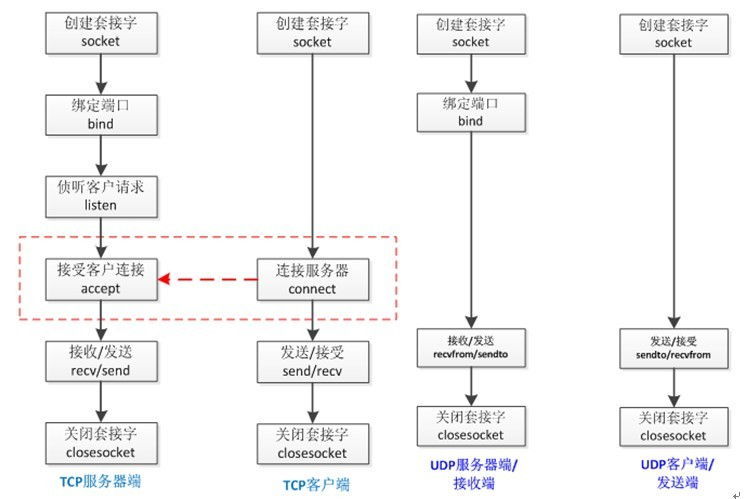
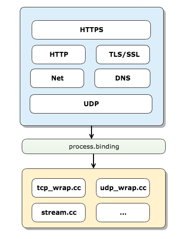

## 深入学习 Node.js Net

<!-- TOC -->

- [深入学习 Node.js Net](#深入学习-nodejs-net)
    - [预备知识](#预备知识)
        - [Socket](#socket)
        - [Node.js 网络模块架构](#nodejs-网络模块架构)
        - [Nagle 算法](#nagle-算法)
        - [nc 命令](#nc-命令)
    - [Node.js net](#nodejs-net)
        - [net 基本使用](#net-基本使用)
        - [TCP Server](#tcp-server)
        - [UNIX Domain Socket](#unix-domain-socket)
    - [总结](#总结)
    - [参考资源](#参考资源)

<!-- /TOC -->

### 预备知识

#### Socket

网络上的两个程序通过一个双向的通信连接实现数据的交换，这个连接的一端称为一个 socket（套接字），因此建立网络通信连接至少要一对端口号。**socket 本质是对 TCP/IP 协议栈的封装，它提供了一个针对 TCP 或者 UDP 编程的接口，并不是另一种协议**。通过 socket，你可以使用 TCP/IP 协议。

> Socket的英文原义是“孔”或“插座”。作为BSD UNIX的[进程通信](https://baike.baidu.com/item/%E8%BF%9B%E7%A8%8B%E9%80%9A%E4%BF%A1)机制，取后一种意思。通常也称作"[套接字](https://baike.baidu.com/item/%E5%A5%97%E6%8E%A5%E5%AD%97)"，用于描述IP地址和端口，是一个通信链的句柄，可以用来实现不同虚拟机或不同计算机之间的通信。在Internet上的[主机](https://baike.baidu.com/item/%E4%B8%BB%E6%9C%BA)一般运行了多个服务软件，同时提供几种服务。每种服务都打开一个Socket，并绑定到一个端口上，不同的端口对应于不同的服务。Socket正如其英文原义那样，像一个多孔插座。一台主机犹如布满各种插座的房间，每个插座有一个编号，有的插座提供220伏交流电， 有的提供110伏交流电，有的则提供有线电视节目。 客户软件将插头插到不同编号的插座，就可以得到不同的服务。—— [百度百科](https://baike.baidu.com/item/socket/281150)

关于 Socket，可以总结以下几点：

* 它可以实现底层通信，几乎所有的应用层都是通过 socket 进行通信的。
* 对 TCP/IP 协议进行封装，便于应用层协议调用，属于二者之间的中间抽象层。
* TCP/IP 协议族中，传输层存在两种通用协议: TCP、UDP，两种协议不同，因为不同参数的 socket 实现过程也不一样。



（图片来源 —— [初步研究node中的网络通信模块](http://zhenhua-lee.github.io/node/socket.html)）

#### Node.js 网络模块架构

在 Node.js 的模块里面，与网络相关的模块有：**Net**、**DNS**、**HTTP**、**TLS/SSL**、**HTTPS**、**UDP/Datagram**，除此之外，还有 v8 底层相关的网络模块有 `tcp_wrap.cc`、`udp_wrap.cc`、`pipe_wrap.cc`、`stream_wrap.cc` 等等，在 JavaScript 层以及 C++ 层之间通过 `process.binding ` 进行桥接相互通信。



（图片来源 —— [Node.js之网络通讯模块浅析](https://segmentfault.com/a/1190000008908077)）

#### Nagle 算法

Nagle 算法描述是当一个连接有未确认的数据，小片段应该保留。当足够的数据已被收件人确认，这些小片段将被分批成能够被传输的更大的片段。

在很多小的数据包传输的网络，理想的情况将小的包集合起来一起发送以减少拥堵。但有时等待时间比其他都重要，所以传送小包是非常重要的。

这对互动应用尤其重要，像 ssh 或者 X Window 系统。在这些应用中，体积小的消息应毫不延迟地输送，以给人实时反馈的感觉。针对这种需求场景，我们可以通过 `setNoDelay(true)` 方法，来关闭 Nagle 算法。

#### nc 命令

nc（netcat）可以用于涉及 TCP 或 UDP 的相关内容，比如通过它我们可以打开 TCP 连接，发送 UDP 数据包，监听任意的 TCP 和 UDP 端口，执行端口扫描和处理 IPv4 和 IPv6 等。

利用 `nc` 命令，我们可以方便地连接一个 UNIX 域套接字（socket）服务器，如：

```shell
$ nc -U /tmp/echo.sock # -U — Use UNIX domain socket
```

socket API 原本是为网络通讯设计的，但后来在 socket 的框架上发展出一种 IPC （Inter-Process Communication）机制，就是 UNIX Domain Socket 也称为本地域。虽然网络 socket 也可用于同一台主机的进程间通讯（通过loopback地址127.0.0.1），但是 UNIX Domain Socket 用于 IPC 更有效率：**不需要经过网络协议栈，不需要打包拆包、计算校验和、维护序号和应答等，只是将应用层数据从一个进程拷贝到另一个进程**。这是因为，IPC 机制本质上是可靠的通讯，而网络协议是为不可靠的通讯设计的。UNIX Domain Socket 也提供面向流和面向数据包两种 API 接口，类似于 TCP 和 UDP，但是面向消息的 UNIX Domain Socket 也是可靠的，消息既不会丢失也不会顺序错乱。

在 Windows 上，本地域通过命名管道实现。路径必须是以 `\\?\pipe\` 或 `\\.\pipe\` 为入口。路径允许任何字符，但后面的字符可能会对管道名称进行一些处理，例如解析 `..` 序列。尽管如此，管道空间是平面的。管道不会持续，当最后一次引用关闭时，管道就会被删除。

### Node.js net

`net` 模块提供了创建基于流的 TCP 或 [IPC](http://nodejs.cn/api/net.html#net_ipc_support) 服务器 ([`net.createServer()`](http://nodejs.cn/api/net.html#net_net_createserver_options_connectionlistener)) 和客户端 ([`net.createConnection()`](http://nodejs.cn/api/net.html#net_net_createconnection)) 的异步网络 API。

#### net 基本使用

server.js

```javascript
// 创建socket服务器
const net = require("net");
let clients = 0;

const server = net.createServer(client => {
  clients++;
  let clientId = clients;
  console.log("Client connect:", clientId);

  client.on("end", () => {
    console.log("Client disconnected:", clientId);
  });

  client.write("Welcome client: " + clientId + " \r\n");
  client.pipe(client); // 把客户端的数据返回给客户端
});

server.listen(8000, () => {
  console.log("Server started on port 8000");
});
```

client.js

```javascript
// 创建socket客户端
const net = require("net");

const client = net.connect(8000);

client.on("data", data => {
  console.log(data.toString());
});

client.on("end", () => {
  console.log("Client disconnected");
});
```

新开两个终端，按顺序执行 `node server.js` 和 `node client.js` 命令后，就可以在控制台看到输出的数据了。

接下来我们来分别分析一下 server.js 和 client.js 文件。

#### TCP Server

```javascript
// 创建socket服务器
const net = require("net");
let clients = 0;

const server = net.createServer(client => {
  // 参考net基本使用相关代码
});

server.listen(8000, () => {
  console.log("Server started on port 8000");
});
```

以上代码通过调用 net.createServer() 方法来创建一个新的 TCP 服务器，该方法的实现如下：

```javascript
function createServer(options, connectionListener) {
  return new Server(options, connectionListener);
}
```

可以看到 net.createServer() 方法内部是通过调用 `Server` 的构造函数创建 TCP 服务器，Server 构造函数（代码片段）如下：

```javascript
function Server(options, connectionListener) {
  if (!(this instanceof Server)) // 确保以new形式调用构造函数
    return new Server(options, connectionListener);

  EventEmitter.call(this);

  if (typeof options === 'function') {
    connectionListener = options;
    options = {};
    this.on('connection', connectionListener);
  } else if (options == null || typeof options === 'object') {
    options = options || {};

    if (typeof connectionListener === 'function') {
      this.on('connection', connectionListener);
    }
  }

  this._connections = 0;
  this._handle = null;
}
util.inherits(Server, EventEmitter);
```

通过观察以上代码，我们发现 Server 类继承了 EventEmitter 类，Server 实例内部会监听 `connection` 事件，该事件触发后，会执行用户设置的 `connectionListener` 回调函数。那么何时会触发 `connection` 事件，通过源码我们发现在 onconnection 函数内部会触发 `connection` 事件，具体如下（代码片段）：

```javascript
function onconnection(err, clientHandle) {
  var handle = this;
  var self = handle.owner;

  // 判断是否超过最大连接数
  if (self.maxConnections && self._connections >= self.maxConnections) {
    clientHandle.close();
    return;
  }

  // util.inherits(Socket, stream.Duplex);
  var socket = new Socket({
    handle: clientHandle,
    allowHalfOpen: self.allowHalfOpen,
    pauseOnCreate: self.pauseOnConnect
  });
  socket.readable = socket.writable = true;


  self._connections++;

  self.emit('connection', socket);
}
```

在 onconnection 函数内部，我们通过调用 Socket 构造函数来创建 socket 对象，因为 Socket 类继承于 stream.Duplex 类，所以 socket 对象也是一个可读可写流，可以使用 stream.Duplex 中定义的方法。

那么接下来的问题就是何时调用 `onconnection` 函数，我们继续在源码中找答案。最终我们发现在 setupListenHandle 函数内部会通过执行 `this._handle.onconnection = onconnection;` 语句设置 `onconnection` 函数。

顾名思义，setupListenHandle 函数的作用是用于设置监听处理器，该函数对象会被绑定到 Server 原型对象的 `_listen2` 属性上：

```javascript
Server.prototype._listen2 = setupListenHandle; 
```

不知道小伙伴们，还记得以下这段代码：

```javascript
server.listen(8000, () => {
  console.log("Server started on port 8000");
});
```

以上代码我们通过 `listen()` 方法来设置 TCP 服务器的监听端口，这里的 `listen()` 方法与 `_listen2()` 方法是不是会有联系？嗯，没错，它们之间有紧密的联系，谁让它们长得像。

接下来我们先来看一下创建 TCP 服务器 `listen()` 方法的签名：

> `server.listen([port\][, host][, backlog][, callback])]`

* 支持 port、host、backlog 和 callback 参数。
* 返回相应的 server 对象。

而创建 IPC 服务器 `listen()` 方法的签名为：

> `server.listen(path[, backlog][, callback])`

* 支持 path（服务器需要监听的路径，详情可以查看 [Identifying paths for IPC connections](http://nodejs.cn/api/net.html#net_identifying_paths_for_ipc_connections)。）backlog 和 callback 参数。
* 返回相应的 server 对象。

这里我们先来分析创建 TCP 服务器的情形：

```javascript
Server.prototype.listen = function(...args) {
  var normalized = normalizeArgs(args);
  var options = normalized[0];
  var cb = normalized[1];

  var hasCallback = (cb !== null);
  if (hasCallback) {
    this.once('listening', cb);
  }

  options = options._handle || options.handle || options;
  
  var backlog; 
  // options.port：8000
  if (typeof options.port === 'number' || typeof options.port === 'string') {
    // start TCP server listening on host:port
    if (options.host) {
      lookupAndListen(this, options.port | 0, options.host, backlog,
        options.exclusive);
    } else { // Undefined host, listens on unspecified address
      // Default addressType 4 will be used to search for master server
      listenInCluster(this, null, options.port | 0, 4,
                      backlog, undefined, options.exclusive);
    }
    return this;
  }
};
```

而 `listenInCluster` 函数的内部实现如下（代码片段）：

```javascript
function listenInCluster(server, address, port, addressType,
                         backlog, fd, exclusive) {
  // 如果exclusive是false（默认），则集群的所有进程将使用相同的底层句柄，允许共享连接处理任务。
  // 如果exclusive是true，则句柄不会被共享，如果尝试端口共享将导致错误。
  exclusive = !!exclusive;

  // 引入cluster(集群)模块
  // Node.js在单个线程中运行单个实例。 用户(开发者)为了使用现在的多核系统，有时候,
  // 用户(开发者)会用一串Node.js进程去处理负载任务。
  if (cluster === null) cluster = require('cluster');

  // 当该进程是主进程时，返回true。
  if (cluster.isMaster || exclusive) {
    // Will create a new handle
    // _listen2 sets up the listened handle, it is still named like this
    // to avoid breaking code that wraps this method
    server._listen2(address, port, addressType, backlog, fd);
    return;
  }
}
```

我们继续来看一下 `_listen2()` 方法（代码片段）：

```javascript
// Server.prototype._listen2 = setupListenHandle; 
function setupListenHandle(address, port, addressType, backlog, fd) {
  if (this._handle) {
    debug('setupListenHandle: have a handle already');
  } else {
    debug('setupListenHandle: create a handle');
    
    var rval = null;
    if (rval === null)
      rval = createServerHandle(address, port, addressType, fd);
    this._handle = rval;
  }

  // 此处绑定onconnection函数
  this._handle.onconnection = onconnection;
}
```

以上代码的核心在于 `createServerHandle` 函数，所以我们继续来分析一下该函数（代码片段）：

```javascript
function createServerHandle(address, port, addressType, fd) {
  var handle;

  var isTCP = false;
  // server.listen(handle[, backlog][, callback])
  // 启动一个服务器，监听已经绑定到端口、UNIX域套接字或Windows命名管道的给定句柄上的连接。
  // 句柄对象可以是服务器、套接字（任何具有底层_handle成员的东西），也可以是含有fd成员的对象，
  // 该成员是一个有效的文件描述符。
  if (typeof fd === 'number' && fd >= 0) {
    try {
      handle = createHandle(fd, true);
    } catch (e) {
      // Not a fd we can listen on.  This will trigger an error.
      debug('listen invalid fd=%d:', fd, e.message);
      return UV_EINVAL;
    }
    handle.open(fd);
    handle.readable = true;
    handle.writable = true;
  } else if (port === -1 && addressType === -1) { // 处理UNIX domain socket或Windows pipe
    handle = new Pipe(PipeConstants.SERVER);
  } else {
    handle = new TCP(TCPConstants.SERVER); // 创建TCP服务
    isTCP = true;
  }
  return handle;
}

function createHandle(fd, is_server) {
  // 基于文件描述符确认handle的类型，TTY(文本终端)
  const type = TTYWrap.guessHandleType(fd);
  if (type === 'PIPE') {
    return new Pipe(
      is_server ? PipeConstants.SERVER : PipeConstants.SOCKET
    );
  }

  if (type === 'TCP') {
    return new TCP(
      is_server ? TCPConstants.SERVER : TCPConstants.SOCKET
    );
  }
}
```

需要注意的是 createHandle 函数中的 Pipe 和 TCP 类内部是由 C++ 实现：

```javascript
const { TCP, constants: TCPConstants } = process.binding('tcp_wrap');
const { Pipe, constants: PipeConstants } = process.binding('pipe_wrap');
```

在 `createServerHandle` 函数内部，如果是创建 TCP 服务器，只需调用 `new TCP(TCPConstants.SERVER)` 即可。现在我们来简单总结一下示例中创建 TCP 服务器的过程：

* 调用 `net.createServer()` 方法创建 server 对象，该对象创建完后，我们调用 `listen()` 方法执行监听操作。
* 在 `listen()` 方法内，将解析相关参数，然后调用 `listenInCluster()` 方法。
* 由于当该进程是主进程，所以 `listenInCluster()`  方法内会直接调用 `_listen2()` 方法。
* 因为 `_listen2` 是指向 `setupListenHandle` 函数，所以最终调用的是 `setupListenHandle` 函数。该函数的主要作用是调用 `createServerHandle` 函数创建对应的 handle 对象（本示例为 TCP 对象），并为该对象设定 `onconnection` 处理器，然后在把返回的对象赋值给 server 对象的 _handle 属性。
* 最后当服务器接收到连接请求时，就会调用 `onconnection` 处理器，随后创建 Socket 对象，并触发 `connection` 事件，然后就会执行我们设置的 connectionListener 监听函数。

#### UNIX Domain Socket

在预备知识章节，我们了解到 UNIX Domain Socket 用于 IPC （Inter-Process Communication）更有效率：

> **不需要经过网络协议栈，不需要打包拆包、计算校验和、维护序号和应答等，只是将应用层数据从一个进程拷贝到另一个进程**。

接下来我们就来介绍一下，如何创建简单的 UNIX 域套接字服务器。

在 `createServerHandle` 函数中，不知道小伙伴们有没有注意到 `port === -1 && addressType === -1` 这一行，竟然有 port 和 addressType（一般为 4 或 6 即表示 IPv4 或 IPv6）为 -1 的情况。其实这就是创建 UNIX domain socket 或 Windows pipe 服务器的场景。

最后我们来创建一个 UNIX 域套接字服务器（实现 echo 功能），具体的示例如下：

```javascript
const net = require("net");
const server = net.createServer(c => {
  c.on("end", () => {
    console.log("client disconnected");
  });
  c.write("hello\r\n");
  c.pipe(c);
});
server.on("error", err => {
  throw err;
});
// server.listen(path[, backlog][, callback]) for IPC servers
server.listen("/tmp/echo.sock", () => {
  console.log("server bound");
});
```

成功运行服务器后，我们就可以用前面介绍的 `nc` 命令来连接 UNIX 域套接字服务器:

```shell
$ nc -U /tmp/echo.sock
```

命令执行后，控制台首先会输出 `hello`，当我们输入任何消息后，UNIX 域套接字服务器也会返回同样的消息：

```shell
➜  ~ nc -U /tmp/echo.sock
hello
semlinker
semlinker
i love node
i love node
```

有兴趣的小伙伴可以亲自动手试一试，体验一下上面 `echo` 服务器。

### 总结

本文通过两个简单的示例，分别介绍了如何创建简单 TCP 和用于 IPC 的 UNIX Domain Socket 服务器，同时也介绍了 Socket、Nagle 算法、nc 命令等相关的知识。其实 Node.js 的 Net 模块还有挺多知识点的，比如核心的 Socket 类，这里就不做进一步介绍了。如果想更全面和深入了解 Net 模块的小伙伴，建议阅读相关的文章或源码。

### 参考资源

* [初步研究node中的网络通信模块](http://zhenhua-lee.github.io/node/socket.html)
* [Node.js之网络通讯模块浅析](https://segmentfault.com/a/1190000008908077)


* [百度百科 - socket](https://baike.baidu.com/item/socket/281150)
* [UNIX Domain Socket IPC](https://akaedu.github.io/book/ch37s04.html)
* [Node.js 中文文档 - net](http://nodejs.cn/api/net.html)