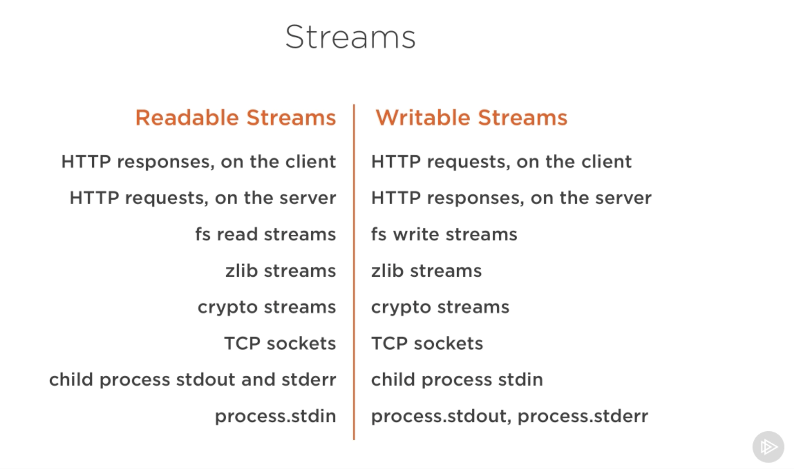
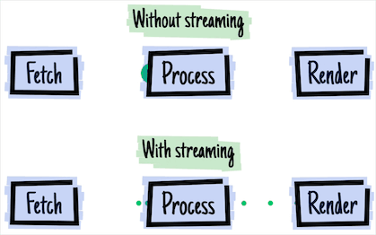
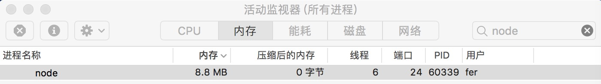
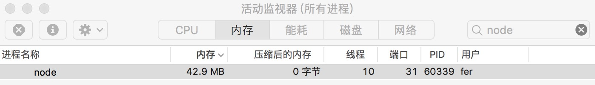
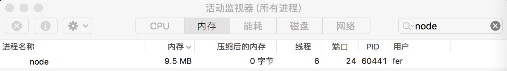
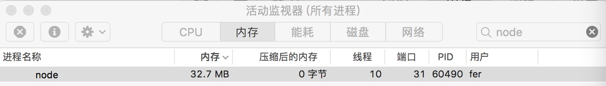
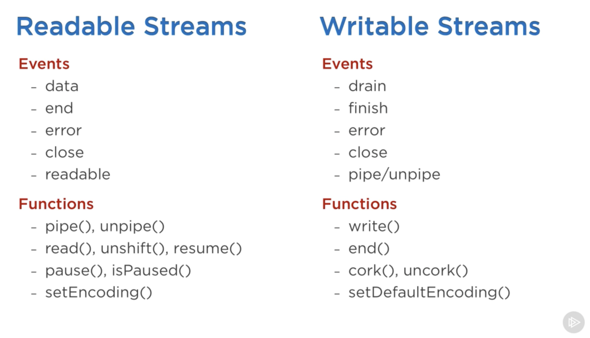

## 深入学习 Node.js Stream 基础篇

<!-- TOC -->

- [深入学习 Node.js Stream 基础篇](#深入学习-nodejs-stream-基础篇)
    - [什么是流](#什么是流)
    - [为什么要使用流](#为什么要使用流)
    - [流实战](#流实战)
        - [创建大文件](#创建大文件)
        - [启动服务器后内存占用](#启动服务器后内存占用)
        - [接收请求后内存占用](#接收请求后内存占用)
        - [重启服务器后内存占用](#重启服务器后内存占用)
        - [pipe优化后内存占用](#pipe优化后内存占用)
    - [流的分类](#流的分类)
    - [参考资源](#参考资源)

<!-- /TOC -->

### 什么是流

流是数据的集合 —— 就像数组或字符串一样。流与它们的不同之处在于，流可能无法立马可用，并且它们不需要全部载入内存中。这种特性使得流能够处理大量数据，或者在一个时刻处理来自外部数据源的数据。

Node.js 中的许多 build-in 模块都实现了流的接口：



（图片来源 ——  Advanced Node.js）

上面列表中有一个特殊的对象，这些对象是可读可写的流，比如 TCP 套接字、zlib 和 crypto 流。

### 为什么要使用流

在 Node.js 中，I/O 都是异步的，所以在和硬盘以及网络的交互过程中会涉及到传递回调函数的过程。

你之前可能会写出这样的代码：

```javascript
var http = require('http');
var fs = require('fs');

var server = http.createServer(function (req, res) {
    fs.readFile(__dirname + '/data.txt', function (err, data) {
        res.end(data);
    });
});
server.listen(8000);
```

上面的这段代码并没有什么问题，但是在每次请求时，我们都会把整个 `data.txt` 文件读入到内存中，然后再把结果返回给客户端。想想看，如果 `data.txt` 文件非常大，在响应大量用户的并发请求时，程序可能会消耗大量的内存，这样很可能会造成用户连接缓慢的问题。

其次，上面的代码可能会造成很不好的用户体验，因为用户在接收到任何的内容之前首先需要等待程序将文件内容完全读入到内存中。

幸运的是，req 请求对象和 res 响应对象都是流对象，这意味着我们可以使用一种更好的方法来实现上面的需求：

```javascript
var http = require('http');
var fs = require('fs');

var server = http.createServer(function (req, res) {
    var stream = fs.createReadStream(__dirname + '/data.txt');
    stream.pipe(res);
});
server.listen(8000);
```

在这里，`.pipe()` 方法会自动帮助我们监听 `data` 和 `end` 事件。上面的这段代码不仅简洁，而且 `data.txt` 文件中每一小段数据都将源源不断的发送到客户端。



（图片来源 —— [2016 - the year of web streams](https://jakearchibald.com/2016/streams-ftw/)）

除此之外，使用 `.pipe()` 方法还有别的好处，比如说它可以自动控制背压，以便在客户端连接缓慢的时候 Node.js 可以将尽可能少的缓存放到内存中。

使用流真的能提高程序的运行效率么？实践是检验真理的唯一标准！我们马上来实践一下。

### 流实战

#### 创建大文件

generate-big-file.js

```javascript
const fs = require('fs');
const file = fs.createWriteStream(__dirname + '/big.file');

for(let i=0; i<= 1e6; i++) {
  file.write('My name is semlinker, i love node!\n');
}

file.end();
```

以上代码，我们通过调用 `fs.createWriteStream()` 方法来创建一个可写流，然后通过循环来写入一百万行的数据。成功运行以上代码，将会生成一个文件名为 `big.file`  （大约35M）的大文件。

接下来我们来创建一个简单的 Node.js Web 服务器，用于响应该大文件的请求：

serve-big-file.js

```javascript
const fs = require("fs");
const server = require("http").createServer((req, res) => {
  fs.readFile("./big.file", (err, data) => {
    if (err) throw err;
    res.end(data);
  });
});

server.listen(8000);
```

当服务器接收到请求时，它将使用异步的 fs.readFile() 方法把 `big.file` 大文件读入内存中，然后返回大文件中的数据。

那么，让我们来看一下当我们启动服务器后，接收到请求后 Node.js 进程内存变化情况。

#### 启动服务器后内存占用



#### 接收请求后内存占用



从以上两张图中，我们发现在服务器接收到请求后，Node.js 进程的内存占用会有较大幅度的增加。那么使用 `pipe()` 能降低内存占用么？我们先来更新一下以上 Node.js Web 服务器的相关代码：

```javascript
const fs = require("fs");
const server = require("http").createServer((req, res) => {
    var stream = fs.createReadStream(__dirname + '/big.file');
    stream.pipe(res);
});

server.listen(8000);
```

#### 重启服务器后内存占用



#### pipe优化后内存占用



通过对比可以发现使用 pipe 优化过的程序，内存占用会减少大约 11 M。如果文件更大的话，比如几百兆，那么优化的效果会更明显，有兴趣的小伙伴可以亲自动手试试，最后我们来介绍一下 Node.js 中流的分类。

### 流的分类

在 Node.js 中有四种类型的流：Readable、Writable、Duplex 和 Transform 流：

- Readable 流表示数据能够被消费，例如可以通过 `fs.createReadStream()` 方法创建可读流。
- Writable 流表示数据能被写，例如可以通过 `fs.createWriteStream()` 方法创建可写流。
- Duplex 流即表示既是 Readable 流也是 Writable 流，如 TCP Socket。
- Transform stream 也是 Duplex 流，能够用来修改或转换数据。例如 `zlib.createGzip` 方法用来使用 gzip 压缩数据。你可以认为 transform 流是一个函数，它的输入是 Writable 流，输出是 Readable 流。

| 使用情景           | 类         | 需要重写的方法            |
| -------------- | --------- | ------------------ |
| 只读             | Readable  | _read              |
| 只写             | Writable  | _write             |
| 双工             | Duplex    | _read, _write      |
| 操作被写入数据，然后读出结果 | Transform | _transform, _flush |

此外所有的流都是 `EventEmitter` 的实例，它们能够监听或触发事件，用于控制读取和写入数据。Readable 与 Writable 流支持的常见的事件和方法如下图所示：



（图片来源 ——  Advanced Node.js）

### 参考资源

* [stream-handbook](https://github.com/substack/stream-handbook)
* [node-js-streams-everything-you-need-to-know](https://medium.freecodecamp.org/node-js-streams-everything-you-need-to-know-c9141306be93)